# VIS - Fishes in inland waters and estuarine habitats in Flanders, Belgium

Jan Breine[^1], Gerlinde Van Thuyne[^1], Hugo Verreycken[^1], Tom De Boeck[^2], Peter Desmet[^2], Dimitri Brosens[^2],

[^1]: Research Institute for Nature and Forest (INBO), Duboislaan 14, 1560, Groenendaal, Belgium

[^2]: Research Institute for Nature and Forest (INBO), Kliniekstraat 25, 1070, Brussels, Belgium

**Corresponding author*: Jan Breine (jan.breine@inbo.be) Estuarine habitats & Gerlinde Van Thuyne (herlinde.vanthuyne@inbo.be) Inland waters

---

Received {date} | Revised {date} | Accepted {date} | Published {date}

---

**Citation**: Combination of authors, year of data paper publication (in parentheses), Title, Journal Name, Volume, Issue number (in parentheses), and doi of the data paper.

---

**Resource Citation**: 

## Abstract

Since 1992 fish stoch assessments were done in Flanders(Belgium). Both inland waters and estuariene waters were monitored within the Flemish Fish Monitoring Network, mainly during the period from March to November (Verreycken, 2011). This network aims to assess fish populations in public waters at regular time intervals. For several reasons,the complete dataset was published on http://data.inbo.be/ipt in two different subsets, VIS-Fish in estuariene habitats and VIS-Fish in inland waters. Both datasets were published by the Research Institute for nature and Forest (INBO), a scientific research institute of the Flemish government in Belgium. This datapaper, on the contrary, deals with both subsets together because of a similar structure, scope and methodology. The sum of the datasets creates a complete overview of fish pertaining in Flanders.

The VIS - Fishes in estuarine habitats in Flanders, Belgium subset is a species occurrence dataset. The dataset contains over 80.000 fish occurrences sampled between 1992 and 2012 from almost 50 locations in the estuaries of the river Yser and the river Scheldt, in Flanders, Belgium. The dataset includes 115 fish species, as well as a number of non-target crustacean species. 
The VIS - Fishes in inland waters in Flanders, Belgium subset is a species occurrence dataset. The dataset contains over 350.000 fish occurrences sampled between 1992 and 2012 from over 2000 locations in inland rivers, streams, canals, and enclosed waters in Flanders, Belgium. The dataset includes over 75 fish species, as well as a number of non-target species (mainly crustaceans). 

The data for both datasets are retrieved from the Fish Information System (VIS), a database set up to monitor the status of fishes and their habitats in Flanders and are collected in support of the Water Framework Directive, the Habitat Directive, certain red lists, and biodiversity research. Additional information, such as measurements, absence information and abiotic data are available upon request. Issues with the VIS-estuary occurrences dataset can be reported at https://github.com/LifeWatchINBO/vis-estuary-occurrences and issues with the VIS-inland watters dataset can be reported at https://github.com/LifeWatchINBO/vis-inland-occurrences

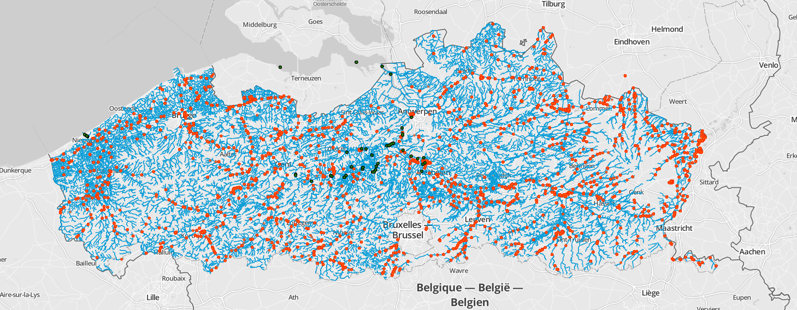
*Map of all the VIS sampling locations. The green dots correspondent with Estuary occurrences, the orange dots with Inland waters* occurrences

## Keywords

Ecosystem function, Biotic integrity index, Fish distribution, Fish, Brackish water, Freshwater VIS, LifeWatch, Occurrence, Observation, Estuary, Scheldt, river Yser

## Data published through

The complete occurrence datasets are integrally downloadable through: 

http://dataset.inbo.be/vis-estuary-occurrences 
http://dataset.inbo.be/vis-inland-occurrences

Reports( Only in Dutch) can be downloaded from:

http://vis.inbo.be/Pages/Common/ReportOverviewPage.aspx

GBIF versions can be found on:

Estuary occurrences: http://www.gbif.org/dataset/274a36be-0626-41c1-a757-3064e05811a4
Inland waters occurrences: http://www.gbif.org/dataset/823dc56e-f987-495c-98bf-43318719e30f Inland waters

## Rationale

The Fish Information System or VIS (http://vis.milieuinfo.be) is a database set up by the Research Institute for Nature and Forest (INBO) to monitor the status of fishes and their habitats in Flanders, Belgium. It contains data regarding occurrences, stocks, pollutants, indexes, and reintroductions. The consolidated database was set up in 2001, but sampling has been going on since 1992. The data are used to calculate the EQR (Ecological Quality Ratio) in the framework of the EU water directive and Natura2000, as well as to provide updated information for the Flemish red list of brackish fishes. This dataset is a standardized extraction of all estuary and inland waters species occurrences in the VIS database. The VIS-database also contains fishes body mass and lengths. This data is only available upon request.

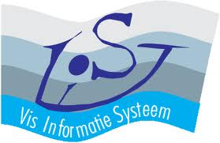

*the logo of VIS, the Fish Information System*

Two separate Darwin Core Archives were generated and published. The main reason herefore is that both datasets cover different habitats and are curated by scientists which have to report to different instances.  Nevertheless the datamodel used for Inland waters and Estuary occurrences is completely the same and the sum of both datasets equals a complete view of Fish occurences in Flanders until the end of the year 2012. Since 2013 a new set sampling locations was identified, therefore the data collected since 2013 is momentarily also only available upon request. 

## Taxonomic coverage

The estuary dataset contains 115 fish species found in the estuaries of the river Yser and the river Scheldt, as well as 8 non-target crustacean species. The class of Actinopterygii is best represented (109 species), along with some Petromyzontida (3 species), and Chondrichthyes (3 species). All the crustaceans in this dataset are from the order of the Decapoda.
This inland waters dataset contains more than 75 fish species found in Flemish streams and rivers, as well as a number of non-target species (mainly crustaceans), some of which are invasive.

### Taxonomic ranks

## Inland waters

**Kingdom**: *Animalia*

**Class**: *Actinopterygii (ray-finned fishes), Petromyzontida, Malacostraca*

**Order**: *Mugiliformes, Osmeriformes, Atheriniformes, Clupeiformes, Decapoda, Gadiformes, Pleuronectiformes, Siluriformes, Salmoniformes, Petromyzontiformes, Scorpaeniformes, Esociformes, Anguilliformes, Gasterosteiformes, Perciformes, Cypriniformes*

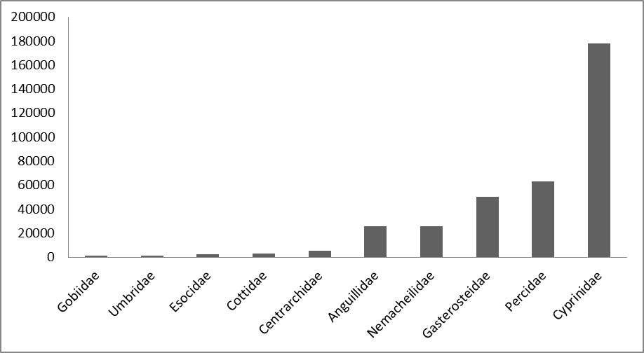

*Taxonomic coverage: orders*

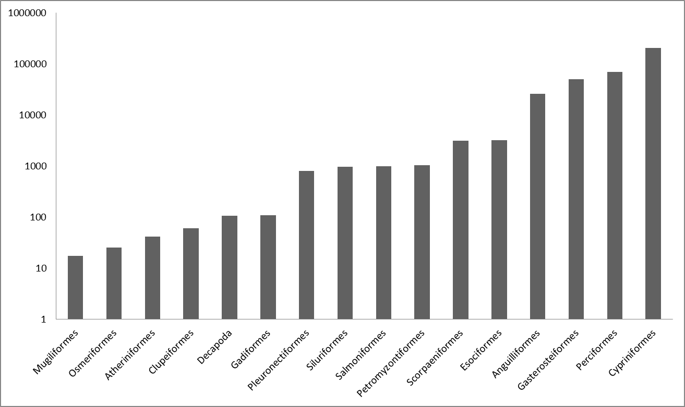
*Taxonomic coverage:orders; log scale*

**Family**: *Cyprinidae, Ictaluridae, Ammodytidae, Anguillidae, Atherinidae, Atyidae, Nemacheilidae, Lotidae, Clariidae, Clupeidae, Cobitidae, Cottidae, Crangonidae, Moronidae, Trachinidae, Grapsidae, Esocidae, Gadidae, Gasterosteidae, Percidae, Petromyzontidae, Centrarchidae, Pleuronectidae, Liparidae, Mugilidae, Gobiidae, Salmonidae, Cambaridae, Osmeridae, Palaemonidae, Scophthalmidae, Siluridae, Soleidae, Syngnathidae, Umbridae, Zoarcidae*

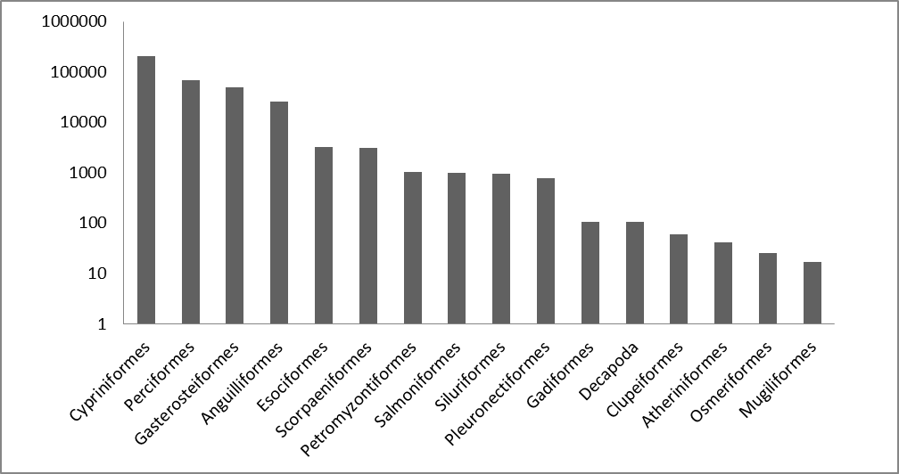

## Estuary occurrences

**Kingdom**: *Animalia*

**Class**: *Actinopterygii (ray-finned fishes), Petromyzontida, Chondrichthyes (cartilaginous fishes), Malacostraca*

**Order**: *Acipenseriformes, Anguilliformes, Atheriniformes, Beloniformes, Clupeiformes, Cypriniformes, Decapoda, Esociformes,Gadiformes, Gasterosteiformes, Mugiliformes, Osmeriformes, Perciformes, Petromyzontiformes, Pleuronectiformes, Rajiformes, Salmoniformes, Scorpaeniformes, Siluriformes, Squaliformes, Squatiniformes, Syngnathiformes*

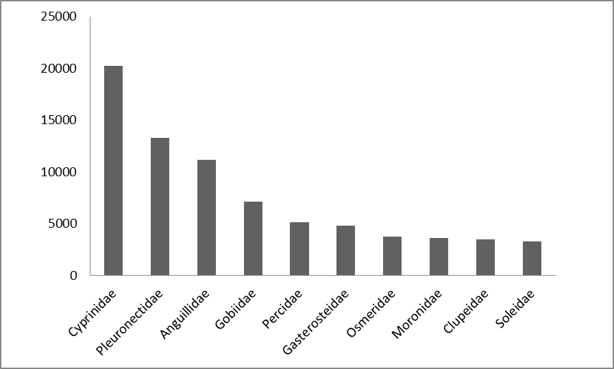
*Taxonomic coverage:orders*

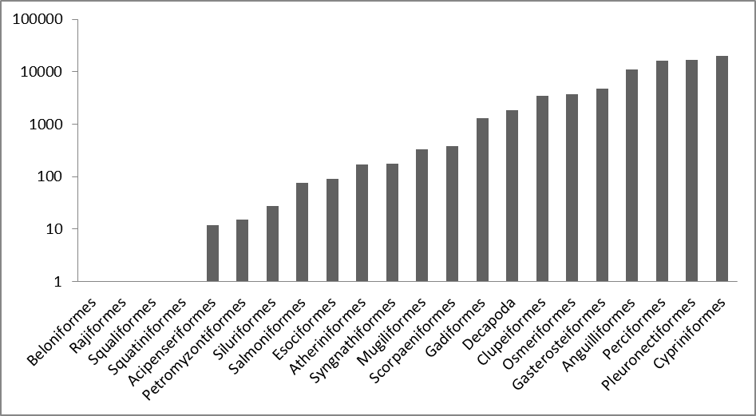

*Taxonomic coverage:orders; log scale*

**Family:** *Acipenseridae, Agonidae, Ammodytidae, Anguillidae, Atherinidae, Belonidae, Blenniidae, Bothidae, Callionymidae, Cancridae, Carangidae, Centrarchidae, Clupeidae, Cobitidae, Congridae, Cottidae, Crangonidae, Cyclopteridae, Cyprinidae, Engraulidae, Esocidae, Gadidae, Gasterosteidae, Gobiidae, Ictaluridae, Liparidae, Lotidae, Moronidae, Mugilidae, Mullidae, Nemacheilidae, Smeridae, Paguridae, Palaemonidae, Percidae, Petromyzontidae, Pholidae, Pleuronectidae,Polybiidae, Portunidae, Rajidae, Salmonidae, Sciaenidae, Scombridae, Scophthalmidae, Siluridae, Soleidae, Squalidae, Squatinidae, Syngnathidae, Trachinidae, Triglidae, Umbridae, Varunidae, Zoarcidae*

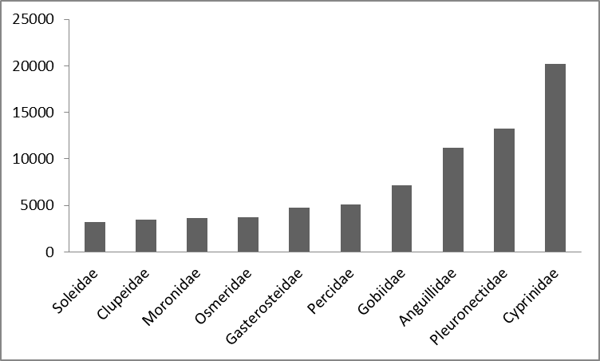

*Taxonomic coverage; 10 most occuring families in the estuarine dataset*

## Geographic coverage

###Flanders
Flanders is one of the 3 official regions of Belgium, a small federeal monarchy in the heart of Western Europe. The Flemsih region is situated in the north of the country and covers an area of 13.522 Km2 (44,29% of Belgium). The Belgian climate is maritime temperate, influenced by the North Sea and the Atlantic Ocean with significant precipitation in all seazons. The summer is moderate and the winters are mild. The two main geographical regions of Flanders are the river Yser basin in the North-West and the Central plain. Flanders is one of the most densely populated areas of Europe. The three major rivers in Flanders are the river Yser, the river Scheldt and the river Meuse. All rivers in Flanders flow into the North Sea but only the river Yser flows completely in the sea within the the jurisdiction of Flanders.

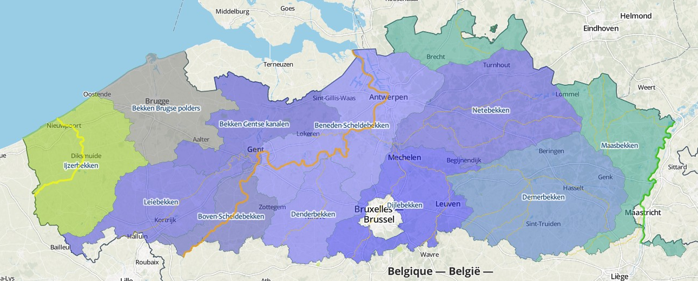

*Flanders is a reagion in the heart of Europe* (img:[http://http://upload.wikimedia.org/wikipedia/commons/8/87/Flemish_Region_in_Belgium_and_Europe.svg](http://http://upload.wikimedia.org/wikipedia/commons/8/87/Flemish_Region_in_Belgium_and_Europe.svg "Flanders") 
 

###Inland waters

The Inland waters dataset deals with enclosed waters and riverine habitats in Flanders, including head streams, affluents and canals part of the drainage basisns of the river Yser, the river Meuse and the river Scheldt. These 3 drainage basisns are divided into 11 Flemisch sub basins, which are divided into 102 sub-basins.

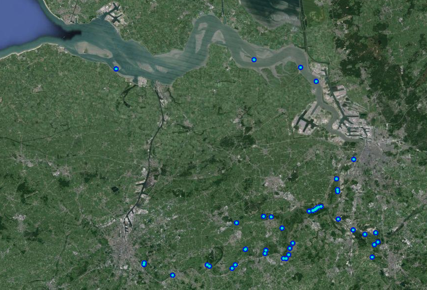

*River Yser (green); Scheldt(light blue); Meuse(light green) 11 Flemsih sub basins, the west green area drain to the river Yser (Ijzerbekken), the blue to the river Scheldt and the eastern green drain to the river Meuse* 

###Estuarien habitats

The Estuarine occurrence dataset deals with the estuaries of the river Scheldt and the river Yser.

#### River Scheldt

The river Scheldt originates on the plateau of Saint-Quentin near Gouy, a small town in the French department of Aisne. The river enters Belgium close to Tournai. Then the river turns East, in the direction of Antwerp. The Scheldt estuary begins near the city of Ghent. The last 160 km of the river, from Ghent to it's delta, the influence of the tides are still visible, creating a unique and valuable landscape for biodiversity. After crossing the city of Antwerp, hosting one of the worlds largests harbours, the Scheldt enters the Netherlands where it ends in the sea.
The Scheldt estuary is one of the last natural delta's in Western Europe and many areas near its riverbanks are marked as Natura 2000 area's. Especially its frechwater estuary area's are unique.

#### River Yser

The Yser originates in French FLanders, enters Belgium in the province of West Flanders and is the only is the only big river in Belgium that flows directly into the sea and is located near the town of Nieuwpoort. The river is 78 km long and Salt and fresh water meet in the estuary wich results in 130 hectares of special biotopes of mud flats, salt marshes, dunes, beaches and polders. The large numbers of coastal and wading birds, such as common shelducks, redshanks, Eurasian oyster catchers and curlews that find food and rest all year round on the mud flats, the salt marshes and the beaches of the Yser estuary.

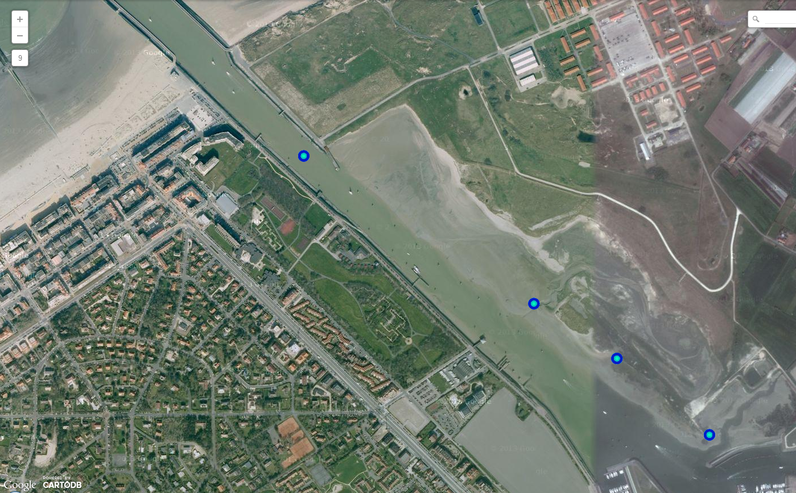

### Bounding box for covered area

Flanders:

WEST 2.54, EAST 5.92, SOUTH 50.68, NORTH 51.51

The Netherlands: 

DECIMALLATITUDE 51.37878 DECIMALLONGITUDE 4.09392 &  DECIMALLATITUDE 51.36278 DECIMALLONGITUDE 3.71067

## Temporal coverage

1992-12-15 - 2012-11-27

## Dataset

### Dataset description

* **Object name**: Darwin Core Archive VIS - Fishes in estuarine habitats in Flanders, Belgium
* **Character encoding**: UTF-8
* **Format name**: Darwin Core Archive format
* **Format version**: 1.0
* **Distribution**: http://dataset.inbo.be/vis-estuary-occurrences
* **Publication date of data**: 2014-04-02
* **Language**: English
* **Licenses of use**: http://creativecommons.org/publicdomain/zero/1.0/ & http://www.canadensys.net/norms
* **Metadata language**: English
* **Date of metadata creation**: 2014-04-02
* **Hierarchy level**: Dataset

* **Object name**: Darwin Core Archive VIS - Fishes in inland waters in Flanders, Belgium
* **Character encoding**: UTF-8
* **Format name**: Darwin Core Archive format
* **Format version**: 1.0
* **Distribution**: http://dataset.inbo.be/vis-inland-occurrences
* **Publication date of data**: 2013-12-20
* **Language**: English
* **Licenses of use**: http://creativecommons.org/publicdomain/zero/1.0/ & http://www.canadensys.net/norms
* **Metadata language**: English
* **Date of metadata creation**: 2013-12-20
* **Hierarchy level**: Dataset

### Additional information

Length and weight measurements of the individual fish, absence information, as well as abiotic data of the sampling points (pH, temperature, etc.) are available upon request. It would be much appreciated if you notify us of your use of this dataset for research or other purposes.

## Methodology

### Study extent description

Four locations in the Yser estuary and 43 locations in the Scheldt estuary in Flanders, Belgium have been sampled since 1992. While the Yser estuary only covers a small geographical area, the Scheldt estuary is with 33.000 hectares one of the largest estuaries in Europe. It is also one of the few remaining European estuaries that include the entire gradient from fresh to saltwater tidal areas (`citation needed`). The 43 sampling locations in the Scheldt estuary are located in the river Scheldt, but also in the rivers "Durme", "Rupel", and "Zenne". In 2001, these locations were consolidated in a monitoring network for Flanders ("VISmeetnet") of 900 sampling points. The geographic coordinates in the dataset are those of the sampling locations. Since these do not always represent the actual coordinates of the catch, which may have occurred further up- or downriver, the coordinateUncertaintyInMeters has been set to 250.

Over 2000 locations in inland rivers, streams, canals, and enclosed waters in Flanders, Belgium have been sampled since 1992. In 2001, these locations were consolidated in a monitoring network ("VISmeetnet") of 900 sampling points. The geographic coordinates in the dataset are those of the sampling locations. Since these do not always represent the actual coordinates of the catch, which may have occurred further up- or downriver, the coordinateUncertaintyInMeters has been set to 250.

### Sampling description

Sampling methods are standardized and described in Van Thuyne, 2010 and indicated in the data as samplingProtocol. Per waterbody, the same method was used for each sampling campaign. The default method in estuarine habitats is paired fyke netting (99%), but additional techniques such as pound netting, electrofishing, and eel fykes netting also have been used. All fish were identified, counted, and measured for length and weight (measurement data available upon request).

Sampling methods are standardized and described in Van Thuyne, 2010 and indicated in the data as samplingProtocol. Per waterbody, the same method was used for each sampling campaign. The default method is electrofishing, but additional techniques such as gill nets, fykes, and seine netting (variable sizes) are used as well. Electrofishing was carried out using a 5kW generator with an adjustable output voltage of 300-500V and a pulse frequency of 480Hz. The number of electrofishing devices and hand-held anodes used depend on the river width. In riverine environments, electrofishing was carried out on both riverbanks in upstream direction. When gill nets were used, a set of four monofilament nylon nets was placed. All fish were identified, counted, and measured for length and weight (measurement data available upon request).

### Quality control description

Strict field protocols where used during the generation of this dataset. The Manual for Application of the European Fish Index (EFI) (Fame consortium, 2004) was used as a guideline for electrofishing and used in support of the EU water framework directive.

Strict field protocols where used during the generation of this dataset. The Manual for Application of the European Fish Index (EFI) (Fame consortium, 2004) was used as a guideline for electrofishing and used in support of the EU water framework directive.

### Method step description

Estuary: fyke fishing, anchor netting, pound netting, electrofishing

Type: Running freshwaters
Width: 1.5m
Depth: <1.30m
Method: electrofishing with 1 anode by wading
Effort: 100m upstream
 
Type: Running freshwaters
Width: 6m
Depth: <1.30m
Method: electrofishing with 2 anodes by wading
Effort: 100m

Type: Running freshwaters
Width: >6m
Depth: <1.30m
Method: electrofishing with 2 anodes by wading
Effort: 250m with 1 anode on each riverbank, 2m from bank

Type: Running freshwaters: streaming rivers
Width: >6m
Depth: >1.30m
Method: electrofishing with 2 anodes by boat
Effort: 250m with 2 anodes on each riverbank, 2m from bank
 
Type: Running freshwaters: enclosed waters, canals, slowly running rivers
Width: >6m
Depth: >1.30m
Method: electrofishing with 2 anodes by boat OR fyke
Effort: 250m with 2 anodes on each riverbank, 2m from bank OR 1 fyke for 48 hours parallel on both riverbanks

Type: Canalized rivers
Width: >6m
Depth: >1.30m
Method: high conductivity seine netting
Effort: 100m, two times complete seine netting

Type: Enclosed waters: lakes
Method: electrofishing OR fyke
Effort: 15% of riverbank (minimum 1000m, maximum 2000m) or 100% if perimeter is less than 1000m OR 1 fyke/hectare (minimum 4, maximum 20 fykes)

## Project data

### Project title

VIS - Fish Information System

### Personnel

* **Principal investigator**: Hugo Verreycken
* **Resource contact, resource creator, metadata provider, point of contact**: Jan Breine
* **Content providers**: Daniel Bombaerts, Jan Breine, Jean-Pierre Croonen, Adinda De Bruyn, Franky Dens, Marc De Wit, Linde Galle, Isabel Lambeens, Yves Maes, Gerlinde Van Thuyne
* **Developer**: Tom De Boeck
* **Processors**: Dimitri Brosens, Peter Desmet

* **Principal investigators**: Jan Breine, Hugo Verreycken
* **Resource contact, resource creator, metadata provider, point of contact**: Gerlinde Van Thuyne
* **Content providers**: Daniel Bombaerts, Jan Breine, Jean-Pierre Croonen, Adinda De Bruyn, Franky Dens, Marc De Wit, Linde Galle, Isabel Lambeens, Yves Maes, Gerlinde Van Thuyne
* **Developer**: Tom De Boeck
* **Processors**: Dimitri Brosens, Peter Desmet

### Funding

Flemish government

## References

FAME Consortium (2004). Manual for the application of the European Fish Index - EFI. A fish-based method to assess the ecological status of European rivers in support of the Water Framework Directive. Version 1.1, January 2005.

Van Thuyne, G., Breine, J. (2011). Visbestandopnames in Vlaamse beken en rivieren in het kader van het 'Meetnet Zoetwatervis' 2010. Rapporten van het Instituut voor Natuur- en Bosonderzoek 2011 (INBO.R.2011.23). Instituut voor Natuur- en Bosonderzoek, Brussel.

Belpaire et al. (2000). An Index of Biotic Integrity characterizing fish populations and the ecological quality of Flandrian water bodies, Hydrobiologia 434: 17–33, 2000.

Van Thuyne, G., Breine, J. (2010). Visbestandopnames in Vlaamse beken en rivieren in het kader van het 'Meetnet Zoetwatervis' 2009. Rapporten van het Instituut voor Natuur- en Bosonderzoek, 2010(42). INBO: Brussel. 196 pp.

Van Thuyne, G., Breine, J. (2009). Visbestandopnames in Vlaamse beken en rivieren in het kader van het 'Meetnet Zoetwatervis' 2008. Rapporten van het Instituut voor Natuur- en Bosonderzoek, R.2009.32. Instituut voor Natuur- en Bosonderzoek: Brussel. 197 pp.

Van Thuyne, G., Breine, J., Belpaire, C. (2008). Visbestanden op de Dommel in het kader van de sanering van de bodem. Rapporten van het Instituut voor Natuur- en Bosonderzoek, 2008(57). Instituut voor Natuur- en Bosonderzoek: Brussel. 48 pp.

Van Thuyne, G., Breine, J. (2008). Visbestandopnames in Vlaamse beken en rivieren afgevist in het kader van het 'Meetnet Zoetwatervis' 2007. Rapporten van het Instituut voor Natuur- en Bosonderzoek, 2008(21). Instituut voor Natuur- en Bosonderzoek: Groenendaal. 154 pp.

Van Thuyne, G., Breine, J., Vrielynck, S. (2007). Visbestandopnames op de Poperingevaart en enkele waterlopen gelegen in het Ijzerbekken. Rapporten van het Instituut voor Natuur- en Bosonderzoek, 2007(42). Instituut voor Natuur- en Bosonderzoek: Groenendaal. 20 pp.

Van Thuyne, G., Breine, J., Vrielynck, S. (2007). Visbestandopnames op enkele waterlopen gelegen in de Brugse polders. Rapporten van het Instituut voor Natuur- en Bosonderzoek, 2007(29). Instituut voor Natuur- en Bosonderzoek: Groenendaal. 23 pp.

Van Thuyne, G., Breine, J. (2007). Visbestandopnames op de Demer (2006). Rapporten van het Instituut voor Natuur- en Bosonderzoek, 2007(10). Instituut voor Natuur- en Bosonderzoek: Groenendaal. 22 pp.

Van Thuyne, G., Breine, J. (2007). Visbestandopnames op de Gaverbeek (2006). Rapporten van het Instituut voor Natuur- en Bosonderzoek, 2007(19). Instituut voor Natuur- en Bosonderzoek: Groenendaal. 15 pp.

Van Thuyne, G., Breine, J. (2007). Visbestandopnames op de Grote Nete en de Grote Laak en enkele van zijn zijbeken (2006). Rapporten van het Instituut voor Natuur- en Bosonderzoek, 2007(21). Instituut voor Natuur- en Bosonderzoek: Groenendaal. 23 pp.

Van Thuyne, G., Breine, J. (2007). Visbestandopnames op de Lossing en zijbeken (2006). Rapporten van het Instituut voor Natuur- en Bosonderzoek, 2007(15). Instituut voor Natuur- en Bosonderzoek: Groenendaal. 16 pp.

Van Thuyne, G., Breine, J. (2007). Visbestandopnames op de Molenbeek-Markebeek en enkele zijbeken (2006). Rapporten van het Instituut voor Natuur- en Bosonderzoek, 2007(4). Instituut voor Natuur- en Bosonderzoek: Brussel.

Van Thuyne, G., Breine, J. (2007). Visbestandopnames op de Poppelse AA en de Leyloop (2006). Rapporten van het Instituut voor Natuur- en Bosonderzoek, 2007(12). Instituut voor Natuur- en Bosonderzoek: Groenendaal. 17.

Van Thuyne, G.;,Breine, J. (2007). Visbestandopnames op enkele beken gelegen in het Demerbekken (2006). Rapporten van het Instituut voor Natuur- en Bosonderzoek, 2007(16). Instituut voor Natuur- en Bosonderzoek: Groenendaal. 22 pp.

Van Thuyne, G., Breine, J. (2007). Visbestandopnames op enkele beken in het bekken van de Benedenschelde (2006). Rapporten van het Instituut voor Natuur- en Bosonderzoek, 2007(11). Instituut voor Natuur- en Bosonderzoek: Groenendaal. 21 pp.

Van Thuyne, G., Breine, J. (2007). Visbestandopnames op enkele zijbeken van de Dender (2006). Rapporten van het Instituut voor Natuur- en Bosonderzoek, 2007(17). Instituut voor Natuur- en Bosonderzoek: Groenendaal. 17 pp.

Van Thuyne, G., Breine, J. (2007). Visbestandopnames op enkele zijbeken van de Leie (2006). Rapporten van het Instituut voor Natuur- en Bosonderzoek, 2007(20). Instituut voor Natuur- en Bosonderzoek: Groenendaal. 16 pp.

Van Thuyne, G., Breine, J. (2007). Visbestandopnames op enkele zijlopen van de Dijle (2006). Rapporten van het Instituut voor Natuur- en Bosonderzoek, 2007(18). Instituut voor Natuur- en Bosonderzoek: Groenendaal. 24 pp.

Van Thuyne, G., Breine, J. (2007). Visbestandopnames op enkele zijlopen van de Maas (2006). Rapporten van het Instituut voor Natuur- en Bosonderzoek, 2007(26). Instituut voor Natuur- en Bosonderzoek: Groenendaal. 18 pp.

Van Thuyne, G., Breine, J. (2007). Visbestandopnames op het Boudewijnkanaal. Rapporten van het Instituut voor Natuur- en Bosonderzoek, 2007(34). Instituut voor Natuur- en Bosonderzoek: Groenendaal. 18 pp.

Van Thuyne, G., Breine, J. (2007). Visbestandopnames op het Dijlekanaal Leuven-Mechelen (2006). Rapporten van het Instituut voor Natuur- en Bosonderzoek, 2007(33). Instituut voor Natuur- en Bosonderzoek: Groenendaal. 22 pp.

Van Thuyne, G., Samsoen, L., Breine, J. (2007). Visbestandopnames op de Bovenschelde. Rapporten van het Instituut voor Natuur- en Bosonderzoek, 2007(25). Instituut voor Natuur- en Bosonderzoek: Groenendaal. 28 pp.

Van Thuyne, G., Samsoen, L., Breine, J. (2007). Visbestandopnames op de Isabellawatering, de Zwarte Sluisbeek en de Nieuwe kale (2006). Rapporten van het Instituut voor Natuur- en Bosonderzoek, 2007(45). Instituut voor Natuur- en Bosonderzoek: Groenendaal. 18 pp.

Van Thuyne, G., Vrielynck, S., Breine, J. (2007). Visbestandopnames op de Damse vaart. Rapporten van het Instituut voor Natuur- en Bosonderzoek, 2007(32). Instituut voor Natuur- en Bosonderzoek: Groenendaal. 18 pp.

Van Thuyne, G. et al. (2006). Visbestandopnames op het Schipdonkkanaal (2005). Rapporten van het instituut voor bosbouw en wildbeheer - sectie visserij, 2006(155). Instituut voor Bosbouw en Wildbeheer: Hoeilaart-Groenendaal. 12 pp.

Van Thuyne, G., Breine, J., Maes, Y. (2006). Visbestandopnames op het Galgenweel (2005). Rapporten van het instituut voor bosbouw en wildbeheer - sectie visserij, 2006(153). Instituut voor Bosbouw en Wildbeheer.

Van Thuyne, G., Maes, Y., Breine, J. (2006). Visbestandopnames op het kanaal van Beverlo (2005). Rapporten van het instituut voor bosbouw en wildbeheer - sectie visserij, 2006(151). Instituut voor Bosbouw en Wildbeheer: Groenendaal : Belgium. 11 pp.

Van Thuyne, G., Samsoen, L., Breine, J. (2006). Visbestandopnames op de Oude Durme (2005). Rapporten van het instituut voor bosbouw en wildbeheer - sectie visserij, 2006(156). Instituut voor Bosbouw en Wildbeheer: Groenendaal-Hoeilaart. 16 pp.

Van Thuyne, G., Samsoen, L., Breine, J. (2006). Visbestandopnames op de oude leiearm te Grammene (2005). Rapporten van het instituut voor bosbouw en wildbeheer - sectie visserij, 2006(154). Instituut voor Bosbouw en Wildbeheer: Groenendaal, Belgium. 16 pp.

Van Thuyne, G., Vrielynck, S., Breine, J. (2006). Visbestandopnames op het kanaal Nieuwpoort-Duinkerke (2005). Rapporten van het instituut voor bosbouw en wildbeheer - sectie visserij, 2006(152). Instituut voor Bosbouw en Wildbeheer: Groenendaal : Belgium. 11 pp.
