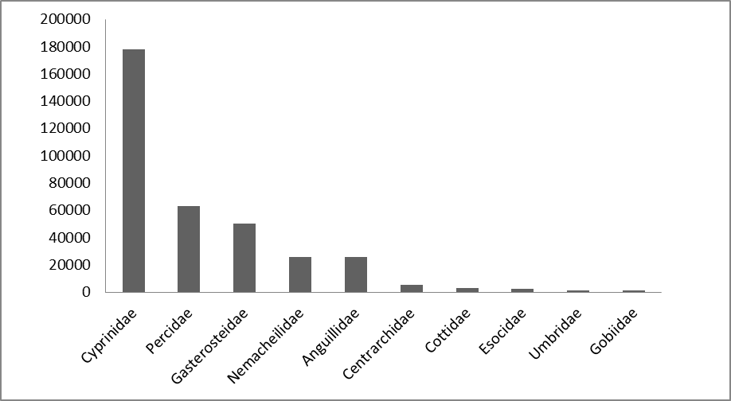

#VIS – A database on the distribution of fishes in inland and estuarine waters in Flanders, Belgium

Jan Breine[^1], Gerlinde Van Thuyne[^1], Hugo Verreycken[^1], Tom De Boeck[^2], Peter Desmet[^2], Claude Belpaire[^1] & Dimitri Brosens[^2]

[^1]: Research Institute for Nature and Forest (INBO), Duboislaan 14, 1560, Groenendaal, Belgium

[^2]: Research Institute for Nature and Forest (INBO), Kliniekstraat 25, 1070, Brussels, Belgium

*Corresponding authors: Estuarine habitats: Jan Breine (jan.breine@inbo.be) & Inland waters: Gerlinde Van Thuyne (Gerlinde.vanthuyne@inbo.be)* 

---

Received {date} | Revised {date} | Accepted {date} | Published {date}

---

**Citation**: Combination of authors, year of data paper publication (in parentheses), Title, Journal Name, Volume, Issue number (in parentheses), and doi of the data paper.

---

**Resource Citation**: Research Institute for nature and Forest (INBO) (2014). VIS – A database on the distribution of fishes in inland and estuarine waters in Flanders, Belgium, +350 000 records. Contributed by Brosens D, Belpaire C, Van Thyne G., Breine J, De Boeck T and Verreycken H. Online at http://data.inbo.be$$$$$$ and http://data.inbo.be$$$$$$$. Version 1.0 (last updated on 3/07/2014), GBIF key:***   $$$$$ $$$$$ $$$$. Data paper ID: doi: $$$$$$$

## Abstract

Since 1992, the Research Institute for Nature and Forest is performing organized fish stock assessments in Flanders(Belgium). Both inland waters and estuaries were monitored within the Flemish Fish Monitoring Network, mainly from March to November (Verreycken, 2011). This network aims to assess fish populations in public waters at regular time intervals. For several reasons the complete dataset was published by INBO on http://data.inbo.be/ipt in two different subsets: ‘VIS-Fish in inland waters’ and ‘VIS-Fish in estuarine habitats’. This data paper, on the contrary, deals with both subsets together as both have a similar structure, scope and methodology. The sum of the datasets presents a complete overview of the distribution and abundance of fish species pertaining in Flanders.

The ‘VIS - Fishes in inland waters’ in Flanders, Belgium subset is a species occurrence dataset. The dataset contains over 350.000 fish observations, sampled between 1992 and 2012 from over 2000 locations in inland rivers, streams, canals, and enclosed waters in Flanders, Belgium. The dataset includes over 64 fish species, as well as a number of non-target species (mainly crustaceans).

The ‘VIS - Fishes in estuarine habitats’ in Flanders, Belgium subset is also a species occurrence dataset. The dataset contains over 80.000 fish observations, sampled between 1995 and 2012 from almost 50 locations in the estuaries of the rivers Yser and Scheldt, in Flanders, Belgium. The dataset includes 116 fish species, as well as a number of non-target crustacean species.
 
The data for both datasets are retrieved from the Fish Information System (VIS), a database set up to monitor the status of fishes and their habitats in Flanders and are collected in support of the Water Framework Directive, the Habitat Directive, the Eel Regulation, the Red List of fishes, the colonization and spreading of non-native fish species, fish stock management and biodiversity research. Additional information, such as measurements on length and weight, absence information and abiotic data are available upon request. Issues regarding inland waters and estuary data can be reported at https://github.com/LifeWatchINBO/vis-inland-occurrences and  https://github.com/LifeWatchINBO/vis-estuary-occurrences, respectively.

*Map of all the VIS sampling locations. The green dots correspondent with Estuary occurrences, the orange dots with Inland waters* occurrences

## Keywords

Ecosystem function, Fish-based index of biotic integrity, Fish distribution, Brackish water, Freshwater, VIS, LifeWatch, Occurrence, Observation, Estuary, River Scheldt, River Yser, River Meuse

## Data published through

The complete occurrence datasets are integrally downloadable through: 

http://dataset.inbo.be/vis-estuary-occurrences 
http://dataset.inbo.be/vis-inland-occurrences

Reports( Only in Dutch) can be downloaded from:

http://vis.inbo.be/Pages/Common/ReportOverviewPage.aspx

GBIF versions can be found on:

Estuary occurrences: http://www.gbif.org/dataset/274a36be-0626-41c1-a757-3064e05811a4
Inland waters occurrences: http://www.gbif.org/dataset/823dc56e-f987-495c-98bf-43318719e30f Inland waters

## Rationale

The Fish Information System or VIS (http://vis.milieuinfo.be) is a database set up by the Research Institute for Nature and Forest (INBO) to calculate the biotic integrity (Karr, 1981, Belpaire 2000 & Breine 2004)) of fish assemblages and to monitor the status of fishes and their habitats in Flanders, Belgium. It contains data regarding occurrences, stocks, pollutants, indices, and non-native fish species. Sampling has been going on since 1992 but the digital database concept was only designed in 1994 (Verbiest et al, 1994), the first database developed in 1996 (Verbiest et al, 1996) and the consolidated database set up in 2001. The database is used for supporting NATURA 2000, an ecological network of protected areas in Europe and to calculate the EQR (Ecological Quality Ratio) in the framework of the EU Water Directive (Directive 2000/60/EC). Further, the database provides updated information for Flemish Red Lists of fishes and lampreys (Verreycken, 2014) and on the distribution status of non-native, invasive fish species. Also, the data is crucial in fish stock management and for the council regulation (EC) N° 1100/2007 on Eel regulation. This dataset is a standardized extraction of all estuary and inland waters species occurrences in the VIS database. The VIS-database also contains fishes body mass and lengths which are only available upon request.

*the logo of VIS, the Fish Information System*

Two separate Darwin Core Archives were generated and published. The main rationale behind this is that both datasets cover different habitats, are not equally sampled and are curated by different scientists. Nevertheless the data model used for Inland waters and Estuary occurrences is identical and the sum of both datasets equals a complete view of fish occurrences in Flanders until the end of 2012. Since 2013 a new set sampling locations was defined, therefore the data collected since 2013 is momentarily only available upon request. 

## Taxonomic coverage

The Inland waters dataset contains 64 fish species found in Flemish streams and rivers(some of which are non-native, invasive species), as well as a number of non-target species (mainly crustaceans). Typical brackish water fish species in this dataset are caught near the sea or just behind the sluice gates near Nieuwpoort, West Flanders.
 
The Estuary dataset contains 116 fish species found in the estuaries of the River Yser and the River Scheldt, as well as 9 non-target crustacean species. The class of Actinopterygii is best represented (110 species), along with three Petromyzontida, and three Chondrichthyes. All the crustaceans in this dataset are from the order of the Decapoda. 

### Taxonomic ranks

## Inland waters

**Kingdom**: *Animalia*

**Class**: *Actinopterygii*

**Order**: *Mugiliformes, Osmeriformes, Atheriniformes, Clupeiformes, Gadiformes, Pleuronectiformes, Siluriformes, Salmoniformes, Petromyzontiformes, Scorpaeniformes, Esociformes, Anguilliformes, Gasterosteiformes, Perciformes, Cypriniformes*

**Family**: *Anguillidae, Atherinidae, Centrarchidae, Clariidae, Clupeidae, Cobitidae, Cottidae, Cyprinidae, Esocidae, Gadidae, Gasterosteidae, Gobiidae, Ictaluridae, Lotidae, Moronidae, Mugilidae, Nemacheilidae, Osmeridae, Percidae, Petromyzontidae, Pleuronectidae, Salmonidae, Scophthalmidae, Siluridae, Soleidae, Umbridae* 

**Class**: *Cephalaspidomorphi* **Order**: *Petromyzontiformes*
**Family**: *Petromyzontidae* 

**Class**: *Malacostraca* **Order**:*Decapoda*
**Family**:*Atyidae,Cambaridae, Palaemonidae, Varunidae*

*Taxonomic coverage: orders*

*Taxonomic coverage:orders; log scale*

*Taxonomic coverage; 10 most occuring families in the estuarine dataset*

## Estuary occurrences

**Kingdom**: *Animalia*

**Class**: *Actinopterygii* 

**Order**: *Acipenseriformes, Anguilliformes, Atheriniformes, Beloniformes, Clupeiformes, Cypriniformes, Esociformes,Gadiformes, Gasterosteiformes, Mugiliformes, Osmeriformes, Perciformes, Pleuronectiformes, Salmoniformes, Scorpaeniformes, Siluriformes, Syngnathiformes*

**Family**:*Acipenseridae, Agonidae, Ammodytidae, Anguillidae, Atherinidae, Belonidae, Blenniidae, Bothidae, Callionymidae,  Centrarchidae, Clupeidae, Cobitidae, Congridae, Cottidae, Cyclopteridae, Cyprinidae, Engraulidae, Esocidae, Gadidae, Gasterosteidae, Gobiidae, Ictaluridae, Liparidae, Lotidae, Moronidae, Mugilidae, Mullidae, Nemacheilidae, Smeridae, Percidae, Petromyzontidae, Pholidae, Pleuronectidae,Polybiidae, Salmonidae, Sciaenidae, Scombridae, Scophthalmidae, Siluridae, Soleidae, Syngnathidae, Trachinidae, Triglidae, Umbridae, Zoarcidae* 

**CLass**:*Chondrichthyes*
**Order**:*Rajiformes, Squaliformes, Squatiniformes*   
**Family**:*Squalidae, Squatinidae, Rajidae* 

**Class**:*Petromyzontida*
**Order**:*Petromyzontiformes*
**Family**:Petromyzontidae*

**Class**:*Malacostraca*
**Order**:*Decapoda*
**Family**:*Cambaridae, Cancridae, Crangonidae, Paguridae, Palaemonidae, Polybiidae, Portunidae, Varunidae*

*Taxonomic coverage:orders*

*Taxonomic coverage:orders; log scale*

*Taxonomic coverage; 10 most occuring families in the estuarine dataset*

## Geographic coverage

###Flanders
Flanders is one of the three administrative regions in the country of Belgium. The Flemish region is situated in the north of the country and covers an area of 13,522 Km2 (44,29% of Belgium). The Belgian climate is maritime temperate, influenced by the North Sea and the Atlantic Ocean with significant precipitation in all seasons. The summer is moderate and the winters are mild. The two main geographical regions of Flanders are the coastal plain in the North-West and the Central plain, further inland. With 470 inhabitants/Km², Flanders is one of the most densely populated areas of Europe. The three major rivers in Flanders are the River Yser, the River Scheldt and the River Meuse. All rivers in Flanders flow into the North Sea but only the River Yser flows completely in the sea within the jurisdiction of Flanders.

*Flanders is a reagion in the heart of Europe* (img:[http://http://upload.wikimedia.org/wikipedia/commons/8/87/Flemish_Region_in_Belgium_and_Europe.svg](http://http://upload.wikimedia.org/wikipedia/commons/8/87/Flemish_Region_in_Belgium_and_Europe.svg "Flanders") 
 

###Inland waters

The ‘Inland waters’ dataset deals with enclosed waters including cut off river arms, gravel pits, ponds, natural lakes and artificial lakes and riverine habitats in Flanders, including head streams, tributaries and canals part of the drainage basins of the rivers Yser, Meuse and Scheldt. These three drainage basins are divided into eleven Flemish river catchments, which are divided into 102 sub basins. Overall, there are 48 unique enclosed waters sampled on 792 spots and 1452 riverine sample points were taken in 419 streams or rivers.

*River Yser (green); Scheldt(light blue); Meuse(light green) 11 Flemsih sub basins, the west green area drain to the river Yser (Ijzerbekken), the blue to the river Scheldt and the eastern green drain to the river Meuse* 

###Estuarien waters

The Estuarine occurrence dataset deals with the estuaries of the river Scheldt and the river Yser.

#### River Scheldt

The River Scheldt is a 435 km long lowland river originating on the plateau of Saint-Quentin near Gouy, a small town in the French department of Aisne. The river enters Belgium close to Tournai. Then the river turns East, in the direction of Antwerp. The tidal influence extends much further land inward than the freshwater-saltwater boundary. As a result, an extensive freshwater region under tidal influence is present. The tidal excursion goes as far as Gent, 160 km from the river mouth, where the tide is stopped by sluices. In the Zeeschelde (the Belgian part of the estuary, three zones are distinguished following the Venice system (1959): (http://www.aslo.org/lo/toc/vol_3/issue_3/0346.pdf)  a mesohaline zone (5-18 g/kg) between Zandvliet and Antwerpen, an oligohaline zone (0.5-5 g/kg) between Antwerpen and Temse, including the Rupel tributary, and a tidal freshwater zone till Gent including the Durme tributary. The marshes and mudflats create a valuable landscape for biodiversity. After crossing the city of Antwerp, the Scheldt enters the Netherlands where it ends in the North Sea near Vlissingen.

The Scheldt estuary is one of the last natural delta's in Western Europe and many areas near its riverbanks are marked as Natura 2000 area's (fig 8b). Especially its frechwater estuary area's are unique.

#### River Yser

The Yser originates in Kassel, located in French Flanders. It enters Belgium in the province of West Flanders and is the only large river in Belgium that flows directly into the sea near the town of Nieuwpoort. The river is 78 km long and sea and fresh water meet in the estuary  resulting in 130 hectares of special biotopes of tidal mud flats, salt marshes, dunes, beaches and polders. 

### Bounding box for covered area

Flanders:

WEST 2.54, EAST 5.92, SOUTH 50.68, NORTH 51.51

The Netherlands: 

Two sampling events happened in the Netherlands.

DECIMALLATITUDE 51.37878 DECIMALLONGITUDE 4.09392 &  DECIMALLATITUDE 51.36278 DECIMALLONGITUDE 3.71067

## Temporal coverage

1992-12-15 - 2012-11-27

## Dataset

### Dataset description

* **Object name**: Darwin Core Archive VIS - Fishes in estuarine habitats in Flanders, Belgium
* **Character encoding**: UTF-8
* **Format name**: Darwin Core Archive format
* **Format version**: 1.0
* **Distribution**: http://dataset.inbo.be/vis-estuary-occurrences
* **Publication date of data**: 2014-04-02
* **Language**: English
* **Licenses of use**: http://creativecommons.org/publicdomain/zero/1.0/ & http://www.canadensys.net/norms
* **Metadata language**: English
* **Date of metadata creation**: 2014-04-02
* **Hierarchy level**: Dataset

* **Object name**: Darwin Core Archive VIS - Fishes in inland waters in Flanders, Belgium
* **Character encoding**: UTF-8
* **Format name**: Darwin Core Archive format
* **Format version**: 1.0
* **Distribution**: http://dataset.inbo.be/vis-inland-occurrences
* **Publication date of data**: 2013-12-20
* **Language**: English
* **Licenses of use**: http://creativecommons.org/publicdomain/zero/1.0/ & http://www.canadensys.net/norms
* **Metadata language**: English
* **Date of metadata creation**: 2013-12-20
* **Hierarchy level**: Dataset

### Additional information

Length and weight measurements of the individual fish, absence information, as well as abiotic data of the sampling points (pH, temperature, etc.) are available upon request. It would be much appreciated if you notify us of your use of this dataset for research or other purposes.

## Methodology

### Study extent description

Over 2000 locations in inland rivers, streams, canals, and enclosed waters in Flanders, Belgium have been sampled since 1992. In 2001, these locations were consolidated in a monitoring network ("VISmeetnet") of 900 sampling points.

Four locations in the Yser estuary and 43 locations in the Scheldt were sampled since 1995. While the Yser estuary only covers a small geographical area, the Scheldt estuary is with 33,000 hectares one of the largest estuaries in Europe. It is also one of the few remaining European estuaries that includes the entire gradient from fresh to saltwater tidal areas (Van den Bergh et al, 2009). The 43 sampling locations in the Scheldt estuary are mainly located in the River Scheldt, but also in the rivers Durme, Rupel, Dijle, Zenne and Nete.
 
The geographic coordinates in both the datasets are those of the sampling locations (Dwc: locationID). Since these do not always represent the actual coordinates of the catch, which may be localized further up- or downriver, the coordinate uncertainty (DwC: coordinateUncertaintyInMeters) has been set to 250 meter.

### Sampling description

The default method used in estuarine waters is paired fyke netting (99%), but additional techniques such as anchor netting, seine netting, pound netting, electric fishing, and eel fyke netting also have been used (Breine et al. 2011). All fish were identified to species level, counted, and measured for length and weight (measurement data available upon request).

Sampling methods in inland waters are standardized and described in Belpaire et al. 2000 and Van Thuyne, 2010 and are indicated in the data as samplingProtocol. Per water body, the same method was used for each sampling event. The default method is electric fishing, but additional techniques such as gill nets, fykes, and seine netting (variable sizes) are used as well. Electric fishing was carried out using a 5kW generator with an adjustable output voltage of 300-500V and a pulse frequency of 480Hz. The number of electric fishing devices and hand-held anodes used depends on the river width (Belpaire et al. 2000). In riverine environments, electric fishing was carried out on both riverbanks in upstream direction. All fish were identified to species level, counted, and measured for length and weight (measurement data available upon request).

### Quality control description

Strict field protocols where used during the generation of this dataset. The Manual for Application of the European Fish Index (EFI) (Fame consortium, 2004) was used as a guideline for electrofishing and used in support of the EU water framework directive.

### Method step description

| Type water          | Method                                                             | Effort        |
| -----------------   |:-----------------------------------------------------------:       | -------------:|
| Running freshwaters `Width: 1.5m` `Depth: <1.30m`|electrofishing with 1 anode by wading  | 100m upstream |
| Running freshwaters `Width: 6m` `Depth: <1.30m` |electrofishing with 2 anodes by wading | 100m 
| Running freshwaters `Width: >6m` `Depth: <1.30m` |electrofishing with 2 anodes by wading | 250m with 1 anode on each riverbank, 2m from bank|
| Running freshwaters: streaming rivers `Width: >6m``Depth: >1.30m`|electrofishing with 2 anodes by boat|250m with 2 anodes on each riverbank, 2m from bank|
| Enclosed waters, canals, slowly running rivers `Width: >6m` `Depth: >1.30m`|electrofishing with 2 anodes by boat OR fyke |250m with 2 anodes on each riverbank, 2m from bank OR 1 fyke for 48 hours parallel on both riverbanks|
|Canalized rivers `Width: >6m``Depth: >1.30m`|high conductivity seine netting | 100m, two times complete seine netting |
| Lakes | electrofishing OR fyke | 15% of riverbank (minimum 1000m, maximum 2000m) or 100% if perimeter is less than 1000m OR 1 fyke/hectare (minimum 4, maximum 20 fykes)|
| Estuary             | fyke fishing, anchor netting, pound netting, electrofishing        |               |

## Project data

### Project title

VIS - Fish Information System

### Personnel

* **Principal investigator**: Hugo Verreycken
* **Resource contact, resource creator, metadata provider, point of contact**: Jan Breine
* **Content providers**: Daniel Bombaerts, Jan Breine, Jean-Pierre Croonen, Adinda De Bruyn, Franky Dens, Marc De Wit, Linde Galle, Isabel Lambeens, Yves Maes, Gerlinde Van Thuyne
* **Developer**: Tom De Boeck
* **Processors**: Dimitri Brosens, Peter Desmet

* **Principal investigators**: Jan Breine, Hugo Verreycken
* **Resource contact, resource creator, metadata provider, point of contact**: Gerlinde Van Thuyne
* **Content providers**: Daniel Bombaerts, Jan Breine, Jean-Pierre Croonen, Adinda De Bruyn, Franky Dens, Marc De Wit, Linde Galle, Isabel Lambeens, Yves Maes, Gerlinde Van Thuyne
* **Developer**: Tom De Boeck
* **Processors**: Dimitri Brosens, Peter Desmet

### Funding

Flemish government

## References

FAME Consortium (2004). Manual for the application of the European Fish Index - EFI. A fish-based method to assess the ecological status of European rivers in support of the Water Framework Directive. Version 1.1, January 2005.

Van Thuyne, G., Breine, J. (2011). Visbestandopnames in Vlaamse beken en rivieren in het kader van het 'Meetnet Zoetwatervis' 2010. Rapporten van het Instituut voor Natuur- en Bosonderzoek 2011 (INBO.R.2011.23). Instituut voor Natuur- en Bosonderzoek, Brussel.

Belpaire et al. (2000). An Index of Biotic Integrity characterizing fish populations and the ecological quality of Flandrian water bodies, Hydrobiologia 434: 17–33, 2000.

Van Thuyne, G., Breine, J. (2010). Visbestandopnames in Vlaamse beken en rivieren in het kader van het 'Meetnet Zoetwatervis' 2009. Rapporten van het Instituut voor Natuur- en Bosonderzoek, 2010(42). INBO: Brussel. 196 pp.

Van Thuyne, G., Breine, J. (2009). Visbestandopnames in Vlaamse beken en rivieren in het kader van het 'Meetnet Zoetwatervis' 2008. Rapporten van het Instituut voor Natuur- en Bosonderzoek, R.2009.32. Instituut voor Natuur- en Bosonderzoek: Brussel. 197 pp.

Van Thuyne, G., Breine, J., Belpaire, C. (2008). Visbestanden op de Dommel in het kader van de sanering van de bodem. Rapporten van het Instituut voor Natuur- en Bosonderzoek, 2008(57). Instituut voor Natuur- en Bosonderzoek: Brussel. 48 pp.

Van Thuyne, G., Breine, J. (2008). Visbestandopnames in Vlaamse beken en rivieren afgevist in het kader van het 'Meetnet Zoetwatervis' 2007. Rapporten van het Instituut voor Natuur- en Bosonderzoek, 2008(21). Instituut voor Natuur- en Bosonderzoek: Groenendaal. 154 pp.

Van Thuyne, G., Breine, J., Vrielynck, S. (2007). Visbestandopnames op de Poperingevaart en enkele waterlopen gelegen in het Ijzerbekken. Rapporten van het Instituut voor Natuur- en Bosonderzoek, 2007(42). Instituut voor Natuur- en Bosonderzoek: Groenendaal. 20 pp.

Van Thuyne, G., Breine, J., Vrielynck, S. (2007). Visbestandopnames op enkele waterlopen gelegen in de Brugse polders. Rapporten van het Instituut voor Natuur- en Bosonderzoek, 2007(29). Instituut voor Natuur- en Bosonderzoek: Groenendaal. 23 pp.

Van Thuyne, G., Breine, J. (2007). Visbestandopnames op de Demer (2006). Rapporten van het Instituut voor Natuur- en Bosonderzoek, 2007(10). Instituut voor Natuur- en Bosonderzoek: Groenendaal. 22 pp.

Van Thuyne, G., Breine, J. (2007). Visbestandopnames op de Gaverbeek (2006). Rapporten van het Instituut voor Natuur- en Bosonderzoek, 2007(19). Instituut voor Natuur- en Bosonderzoek: Groenendaal. 15 pp.

Van Thuyne, G., Breine, J. (2007). Visbestandopnames op de Grote Nete en de Grote Laak en enkele van zijn zijbeken (2006). Rapporten van het Instituut voor Natuur- en Bosonderzoek, 2007(21). Instituut voor Natuur- en Bosonderzoek: Groenendaal. 23 pp.

Van Thuyne, G., Breine, J. (2007). Visbestandopnames op de Lossing en zijbeken (2006). Rapporten van het Instituut voor Natuur- en Bosonderzoek, 2007(15). Instituut voor Natuur- en Bosonderzoek: Groenendaal. 16 pp.

Van Thuyne, G., Breine, J. (2007). Visbestandopnames op de Molenbeek-Markebeek en enkele zijbeken (2006). Rapporten van het Instituut voor Natuur- en Bosonderzoek, 2007(4). Instituut voor Natuur- en Bosonderzoek: Brussel.

Van Thuyne, G., Breine, J. (2007). Visbestandopnames op de Poppelse AA en de Leyloop (2006). Rapporten van het Instituut voor Natuur- en Bosonderzoek, 2007(12). Instituut voor Natuur- en Bosonderzoek: Groenendaal. 17.

Van Thuyne, G.;,Breine, J. (2007). Visbestandopnames op enkele beken gelegen in het Demerbekken (2006). Rapporten van het Instituut voor Natuur- en Bosonderzoek, 2007(16). Instituut voor Natuur- en Bosonderzoek: Groenendaal. 22 pp.

Van Thuyne, G., Breine, J. (2007). Visbestandopnames op enkele beken in het bekken van de Benedenschelde (2006). Rapporten van het Instituut voor Natuur- en Bosonderzoek, 2007(11). Instituut voor Natuur- en Bosonderzoek: Groenendaal. 21 pp.

Van Thuyne, G., Breine, J. (2007). Visbestandopnames op enkele zijbeken van de Dender (2006). Rapporten van het Instituut voor Natuur- en Bosonderzoek, 2007(17). Instituut voor Natuur- en Bosonderzoek: Groenendaal. 17 pp.

Van Thuyne, G., Breine, J. (2007). Visbestandopnames op enkele zijbeken van de Leie (2006). Rapporten van het Instituut voor Natuur- en Bosonderzoek, 2007(20). Instituut voor Natuur- en Bosonderzoek: Groenendaal. 16 pp.

Van Thuyne, G., Breine, J. (2007). Visbestandopnames op enkele zijlopen van de Dijle (2006). Rapporten van het Instituut voor Natuur- en Bosonderzoek, 2007(18). Instituut voor Natuur- en Bosonderzoek: Groenendaal. 24 pp.

Van Thuyne, G., Breine, J. (2007). Visbestandopnames op enkele zijlopen van de Maas (2006). Rapporten van het Instituut voor Natuur- en Bosonderzoek, 2007(26). Instituut voor Natuur- en Bosonderzoek: Groenendaal. 18 pp.

Van Thuyne, G., Breine, J. (2007). Visbestandopnames op het Boudewijnkanaal. Rapporten van het Instituut voor Natuur- en Bosonderzoek, 2007(34). Instituut voor Natuur- en Bosonderzoek: Groenendaal. 18 pp.

Van Thuyne, G., Breine, J. (2007). Visbestandopnames op het Dijlekanaal Leuven-Mechelen (2006). Rapporten van het Instituut voor Natuur- en Bosonderzoek, 2007(33). Instituut voor Natuur- en Bosonderzoek: Groenendaal. 22 pp.

Van Thuyne, G., Samsoen, L., Breine, J. (2007). Visbestandopnames op de Bovenschelde. Rapporten van het Instituut voor Natuur- en Bosonderzoek, 2007(25). Instituut voor Natuur- en Bosonderzoek: Groenendaal. 28 pp.

Van Thuyne, G., Samsoen, L., Breine, J. (2007). Visbestandopnames op de Isabellawatering, de Zwarte Sluisbeek en de Nieuwe kale (2006). Rapporten van het Instituut voor Natuur- en Bosonderzoek, 2007(45). Instituut voor Natuur- en Bosonderzoek: Groenendaal. 18 pp.

Van Thuyne, G., Vrielynck, S., Breine, J. (2007). Visbestandopnames op de Damse vaart. Rapporten van het Instituut voor Natuur- en Bosonderzoek, 2007(32). Instituut voor Natuur- en Bosonderzoek: Groenendaal. 18 pp.

Van Thuyne, G. et al. (2006). Visbestandopnames op het Schipdonkkanaal (2005). Rapporten van het instituut voor bosbouw en wildbeheer - sectie visserij, 2006(155). Instituut voor Bosbouw en Wildbeheer: Hoeilaart-Groenendaal. 12 pp.

Van Thuyne, G., Breine, J., Maes, Y. (2006). Visbestandopnames op het Galgenweel (2005). Rapporten van het instituut voor bosbouw en wildbeheer - sectie visserij, 2006(153). Instituut voor Bosbouw en Wildbeheer.

Van Thuyne, G., Maes, Y., Breine, J. (2006). Visbestandopnames op het kanaal van Beverlo (2005). Rapporten van het instituut voor bosbouw en wildbeheer - sectie visserij, 2006(151). Instituut voor Bosbouw en Wildbeheer: Groenendaal : Belgium. 11 pp.

Van Thuyne, G., Samsoen, L., Breine, J. (2006). Visbestandopnames op de Oude Durme (2005). Rapporten van het instituut voor bosbouw en wildbeheer - sectie visserij, 2006(156). Instituut voor Bosbouw en Wildbeheer: Groenendaal-Hoeilaart. 16 pp.

Van Thuyne, G., Samsoen, L., Breine, J. (2006). Visbestandopnames op de oude leiearm te Grammene (2005). Rapporten van het instituut voor bosbouw en wildbeheer - sectie visserij, 2006(154). Instituut voor Bosbouw en Wildbeheer: Groenendaal, Belgium. 16 pp.

Van Thuyne, G., Vrielynck, S., Breine, J. (2006). Visbestandopnames op het kanaal Nieuwpoort-Duinkerke (2005). Rapporten van het instituut voor bosbouw en wildbeheer - sectie visserij, 2006(152). Instituut voor Bosbouw en Wildbeheer: Groenendaal : Belgium. 11 pp.
