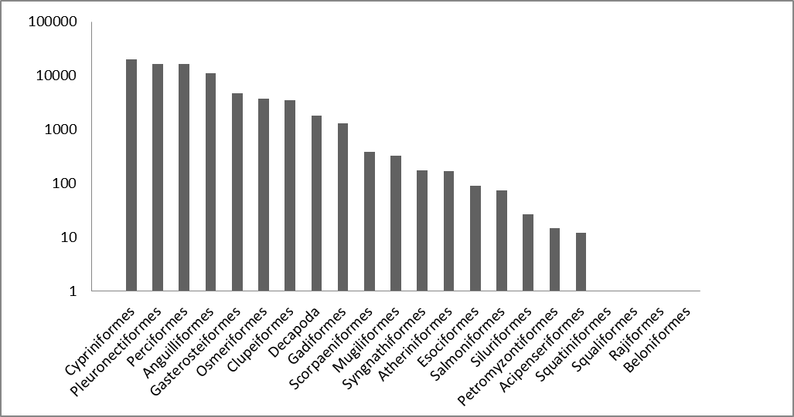
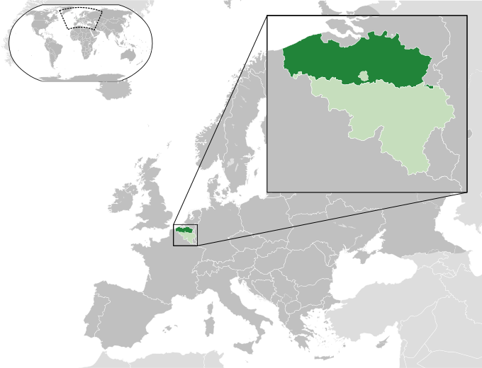

#VIS – A database on the distribution of fishes in inland and estuarine waters in Flanders, Belgium

Jan Breine[^1], Gerlinde Van Thuyne[^1], Hugo Verreycken[^1], Tom De Boeck[^2], Peter Desmet[^2], Claude Belpaire[^1] & Dimitri Brosens[^2]

[^1/ Research Institute for Nature and Forest (INBO), Duboislaan 14, 1560, Groenendaal, Belgium

[^2/ Research Institute for Nature and Forest (INBO), Kliniekstraat 25, 1070, Brussels, Belgium

*Corresponding authors: estuarine waters: Jan Breine (jan.breine@inbo.be) & inland waters: Gerlinde Van Thuyne (Gerlinde.vanthuyne@inbo.be)* 

---

Received {date} | Revised {date} | Accepted {date} | Published {date}

---

**Citation**: Combination of authors, year of data paper publication (in parentheses), Title, Journal Name, Volume, Issue number (in parentheses), and doi of the data paper.

---

**Resource Citation**: Research Institute for nature and Forest (INBO) (2014). VIS – A database on the distribution of fishes in inland and estuarine waters in Flanders, Belgium, +350 000 records. Contributed by Brosens D, Belpaire C, Van Thyne G., Breine J, De Boeck T and Verreycken H. Online at http://data.inbo.be$$$$$$ and http://data.inbo.be$$$$$$$. Version 1.0 (last updated on 3/07/2014), GBIF key:***   $$$$$ $$$$$ $$$$. Data paper ID: doi: $$$$$$$

## Abstract

Since 1992, the Research Institute for Nature and Forest is performing standardized fish stock assessments in Flanders (Belgium). Both inland waters and estuaries were monitored within the Flemish Fish Monitoring Network, mainly from March to November (Verreycken et al., 2011). This network aims to assess fish populations in public waters at regular time intervals. The complete dataset was published by INBO on [http://data.inbo.be/ipt](http://data.inbo.be/ipt) in two different subsets: ‘VIS-Fish in inland waters’ and ‘VIS-Fish in estuarine waters’. This data paper, on the contrary, deals with both subsets together as both have a similar structure, scope and methodology. The sum of the datasets presents a complete overview of the distribution and abundance of fish species pertaining in Flanders (figure 1).
The ‘VIS - Fishes in inland waters’ in Flanders, Belgium subset is a species occurrence dataset. The dataset contains over 350.000 fish observations, sampled between 1992 and 2012 from over 2000 locations in inland rivers, streams, canals, and enclosed waters in Flanders, Belgium. The dataset includes over 64 fish species, as well as a number of non-target species (mainly crustaceans).
The ‘VIS - Fishes in estuarine waters’ in Flanders, Belgium subset is also a species occurrence dataset. The dataset contains over 70.000 fish observations, sampled between 1995 and 2012 from almost 50 locations in the estuaries of the rivers Yser and Scheldt (“Zeeschelde”), in Flanders, Belgium except for two sampling sites in the Netherlands. The dataset includes 116 fish species and a number of non-target crustacean species.
The data for both datasets are retrieved from the Fish Information System [VIS](http://vis.milieuinfo.be), a database set up to monitor the status of fishes and their habitats in Flanders. This monitoring was set up in support of the Water Framework Directive, the Habitat Directive, the Eel Regulation, the Red List of fishes, the colonization and spreading of non-native fish species, fish stock management and biodiversity research. Additional information, such as measurements on length and weight, absence information and abiotic data are available upon request. Issues regarding inland waters and estuary data can be reported at [https://github.com/LifeWatchINBO/vis-inland-occurrences](https://github.com/LifeWatchINBO/vis-inland-occurrences) and [https://github.com/LifeWatchINBO/vis-estuary-occurrences](https://github.com/LifeWatchINBO/vis-estuary-occurrences), respectively.

*Figure 1: Map of all the VIS sampling locations. The orange dots correspond with Inland waters, the green dots correspond with Estuary occurrences* 

## Keywords

Ecosystem function, Fish-based index of biotic integrity, Fish distribution, Brackish water, Freshwater, VIS, LifeWatch, Occurrence, Observation, Estuary, River Scheldt, River Yser, River Meuse

## Data published through

The complete occurrence data-sets are integrally down-loadable through: 

VIS Estuary occurrences [http://dataset.inbo.be/vis-estuary-occurrences](http://dataset.inbo.be/vis-estuary-occurrences) 

Vis Inland waters occurrences [http://dataset.inbo.be/vis-inland-occurrences](http://dataset.inbo.be/vis-inland-occurrences)

Reports (Only in Dutch) can be generated and downloaded from:

[http://vis.inbo.be/Pages/Common/ReportOverviewPage.aspx](http://vis.inbo.be/Pages/Common/ReportOverviewPage.aspx)

GBIF versions can be found on:

Estuary occurrences: [http://www.gbif.org/dataset/274a36be-0626-41c1-a757-3064e05811a4](http://www.gbif.org/dataset/274a36be-0626-41c1-a757-3064e05811a4)

Inland waters occurrences: [http://www.gbif.org/dataset/823dc56e-f987-495c-98bf-43318719e30f](http://www.gbif.org/dataset/823dc56e-f987-495c-98bf-43318719e30f)

## Rationale

The Fish Information System (figure 2) or [VIS](http://vis.milieuinfo.be) is a database set up by the Research Institute for Nature and Forest (INBO) to monitor the status of fishes and their habitats in Flanders, Belgium and to calculate the biotic integrity (Karr, 1981; Belpaire et al., 2000 & Breine et al., 2004, 2007, 2007)) of fish assemblages. It contains data regarding occurrences, stocks, pollutants, indices, and non-native fish species. Sampling has been going on since 1992, the digital database concept was designed in 1994 (Verbiest et al, 1994), the first database developed in 1996 (Verbiest et al, 1996) and the consolidated database set up in 2001. The database is used for supporting NATURA 2000, an ecological network of protected areas in Europe and to calculate the EQR (Ecological Quality Ratio) in the framework of the EU Water Directive (Directive 2000/60/EC). Further, the database provides updated information for Flemish Red Lists of fishes and lampreys (Verreycken et al., 2014) and on the distribution status of non-native, invasive fish species. Also, the data is crucial in fish stock management and for reporting on the status of the European eel stock as required by the Eel Regulation (Council Regulation (EC) N° 1100/2007). This dataset is a standardized extraction of all estuary and inland waters species occurrences in the VIS database. The VIS-database also contains individual morphometric data such as fish body mass and length, which are only available upon request.

*Figure 2: the logo of VIS, the Fish Information System*

Two separate Darwin Core Archives were generated and published. The main rationale behind this is that both datasets cover different habitats, differ in sampling strategies and methods and are curated by different scientists. Nevertheless the data model used for inland waters and estuarine waters is identical and the merge of both datasets represents a complete overview of fish distribution in Flanders until the end of 2012. Since 2013 a new set sampling locations was defined, therefore the data collected since 2013 is momentarily only available upon request.

## Taxonomic coverage

The inland waters dataset contains 64 fish species reported from Flemish enclosed waters and watercourses (some of which are non-native, invasive species), as well as a number of non-target species (mainly crustaceans). This dataset also includes a number of typical brackish water fish species which sometimes can be found in inland water sites at proximity of the sea and/or behind the sluice gates. The class of Actinopterygii is best represented (63 species), along with one Petromyzontida (Lampetra planeri) and 7 crustaceans from the order Decapoda.
 
The estuarine waters dataset contains 116 fish species found in the estuaries of the River Yser and the River Scheldt, as well as 9 non-target crustacean species. The class of Actinopterygii is best represented (110 species), along with three Petromyzontida, and three Chondrichthyes. All the crustaceans in this dataset are from the order of the Decapoda.

## Taxonomic ranks

### Inland waters

**Kingdom**: *Animalia*

**Class**: *Actinopterygii*

**Order**: *Mugiliformes, Osmeriformes, Atheriniformes, Clupeiformes, Gadiformes, Pleuronectiformes, Siluriformes, Salmoniformes, Scorpaeniformes, Esociformes, Anguilliformes, Gasterosteiformes, Perciformes, Cypriniformes*

**Family**: *Anguillidae, Atherinidae, Centrarchidae, Clariidae, Clupeidae, Cobitidae, Cottidae, Cyprinidae, Esocidae, Gadidae, Gasterosteidae, Gobiidae, Ictaluridae, Lotidae, Moronidae, Mugilidae, Nemacheilidae, Osmeridae, Percidae, Petromyzontidae, Pleuronectidae, Salmonidae, Scophthalmidae, Siluridae, Soleidae, Umbridae*

*Figure 3: Taxonomic coverage; 10 most observed families in the inland waters dataset*

**Class**:  *Petromyzontida*

**Order**:  *Petromyzontiformes*

**Family**:  *Petromyzontidae*

**Class**:  *Malacostraca*
**Order**: *Decapoda* 
**Family**: *Atyidae, Cambaridae, Palaemonidae, Varunidae*

*Figure 3a: Number of observations by order in the Inland waters dataset (period 1992-2012)*

*Figure 3b: Number of observations by order in the Inland waters dataset (period 1992-2012); log scale*

### Estuary waters

**Kingdom**: *Animalia*

**Class**: *Actinopterygii*

**Order**: *Acipenseriformes, Anguilliformes, Atheriniformes, Beloniformes, Clupeiformes, Cypriniformes, Esociformes,Gadiformes, Gasterosteiformes, Mugiliformes, Osmeriformes, Perciformes, Pleuronectiformes, Salmoniformes, Scorpaeniformes, Siluriformes, Syngnathiformes*

**Family**: *Acipenseridae, Agonidae, Ammodytidae, Anguillidae, Atherinidae, Belonidae, Blenniidae, Bothidae, Callionymidae, Centrarchidae, Clupeidae, Cobitidae, Congridae, Cottidae, Cyclopteridae, Cyprinidae, Engraulidae, Esocidae, Gadidae, Gasterosteidae, Gobiidae, Ictaluridae, Liparidae, Lotidae, Moronidae, Mugilidae, Mullidae, Nemacheilidae, Smeridae, Percidae, Petromyzontidae, Pholidae, Pleuronectidae,Polybiidae, Salmonidae, Sciaenidae, Scombridae, Scophthalmidae, Siluridae, Soleidae, Syngnathidae, Trachinidae, Triglidae, Umbridae, Zoarcidae*

*Figure 4: Taxonomic coverage; 10 most observed families in the estuarine dataset*

**CLass**:*Chondrichthyes*
**Order**:*Rajiformes, Squaliformes, Squatiniformes*   
**Family**:*Squalidae, Squatinidae, Rajidae* 

**Class**:*Petromyzontida*
**Order**:*Petromyzontiformes*
**Family**:Petromyzontidae*

**Class**:*Malacostraca*
**Order**:*Decapoda*
**Family**:*Cambaridae, Cancridae, Crangonidae, Paguridae, Palaemonidae, Polybiidae, Portunidae, Varunidae*

*Figure 4a: Number of observations by order in the estuarine waters dataset (period 1992-2012);*

*Figure 4b: Number of observations by order in the estuarine waters dataset (period 1992-2012); log scale*

## Geographic coverage

###Flanders
Flanders is one of the three administrative regions in the country of Belgium. The Flemish region is situated in the north of the country and covers an area of 13,522 km2 (44,29% of Belgium). The Belgian climate is maritime temperate, influenced by the North Sea and the Atlantic Ocean with significant precipitation in all seasons. The summer is moderate and the winters are mild. The two main geographical regions of Flanders are the coastal plain in the North-West and the Central plain, further inland. With 470 inhabitants/km², Flanders is one of the most densely populated areas of Europe. The three major rivers are the River Yser, the River Scheldt and the River Meuse. All rivers in Flanders flow into the North Sea but only the River Yser flows directly in the sea within the jurisdiction of Flanders.

*Figure 5: Flanders is a region in the centre of Western Europe* (img:[http://http://upload.wikimedia.org/wikipedia/commons/8/87/Flemish_Region_in_Belgium_and_Europe.svg](http://http://upload.wikimedia.org/wikipedia/commons/8/87/Flemish_Region_in_Belgium_and_Europe.svg "Flanders") 
 

###Inland waters

The inland waters dataset deals with enclosed waters including cut off river arms, gravel pits, ponds, natural lakes and artificial lakes and riverine habitats in Flanders, including head streams, tributaries and canals part of the drainage basins of the rivers Yser, Meuse and Scheldt (figure 6). These three drainage basins are divided into eleven Flemish river catchments, which are divided into 102 sub basins. Overall, there are 48 unique enclosed waters sampled on 792 spots and 1452 riverine sample points were taken in 419 streams or rivers.

*Figure 6: Drainages of the Rivers Yser (green in west); Scheldt (light blue, blue and purple) and Meuse (light green in east) are divided in 11 Flemish subbasins. The grey area drains directly to the sea.* 

###Estuarine waters

The Estuarine waters occurrence dataset deals with the estuaries of the River Scheldt and the River Yser.

#### River Scheldt

The River Scheldt is a 435 km long lowland river originating on the plateau of Saint-Quentin near Gouy, a small town in the French department of Aisne. The river enters Belgium close to Tournai. Then the river turns east, in the direction of Antwerp. The tidal influence extends much further land inward than the freshwater-saltwater boundary. As a result, an extensive freshwater region under tidal influence is present. The tidal activity goes as far as Ghent (figure 7), 160 km from the river mouth, where the tide is stopped by sluices. In the Zeeschelde (the Belgian part of the estuary), three zones are distinguished following the Venice system (1959) (http://www.aslo.org/lo/toc/vol_3/issue_3/0346.pdf): a mesohaline zone (5-18 g salt/kg) between Zandvliet and Antwerp, an oligohaline zone (0.5-5 g salt/kg) between Antwerp and Temse, including the Rupel tributary, and a tidal freshwater zone till Ghent including the Durme tributary. The marshes and mudflats create a valuable landscape for biodiversity. After crossing the city of Antwerp, the Scheldt enters the Netherlands where it ends in the North Sea near Vlissingen.

*Figure 7: Areal foto of the Scheldt Estuary, sampling locations are marked in blue*

The Scheldt estuary is one of the last natural deltas in Western Europe and many areas near its riverbanks are marked as Natura 2000 area's (figure 8). Especially its frechwater estuary areas are unique.

*Figure 8: Natura 2000 area's near the riverbanks of the Scheldt River.*

#### River Yser

The Yser originates in Kassel, located in French Flanders. It enters Belgium in the province of West Flanders and flows into the sea near the town of Nieuwpoort. The river is 78 km long and sea and fresh water meet in the estuary resulting in 130 hectares of special biotopes (figure 9) of tidal mud flats, salt marshes, dunes, beaches and polders. 

*Figure 9: The sampling locations (locationID) in the Yser estuary*

### Bounding box for covered area

Flanders:

WEST 2.54, EAST 5.92, SOUTH 50.68, NORTH 51.51

## Temporal coverage

1992-12-15 - 2012-11-27

## Dataset

### Dataset description

* **Object name**: Darwin Core Archive VIS - Fishes in estuarine waters in Flanders, Belgium
* **Character encoding**: UTF-8
* **Format name**: Darwin Core Archive format
* **Format version**: 1.0
* **Distribution**: http://dataset.inbo.be/vis-estuary-occurrences
* **Publication date of data**: 2014-04-02
* **Language**: English
* **Licenses of use**: http://creativecommons.org/publicdomain/zero/1.0/ & http://www.canadensys.net/norms
* **Metadata language**: English
* **Date of metadata creation**: 2014-04-02
* **Hierarchy level**: Dataset

* **Object name**: Darwin Core Archive VIS - Fishes in inland waters in Flanders, Belgium
* **Character encoding**: UTF-8
* **Format name**: Darwin Core Archive format
* **Format version**: 1.0
* **Distribution**: http://dataset.inbo.be/vis-inland-occurrences
* **Publication date of data**: 2013-12-20
* **Language**: English
* **Licenses of use**: http://creativecommons.org/publicdomain/zero/1.0/ & http://www.canadensys.net/norms
* **Metadata language**: English
* **Date of metadata creation**: 2013-12-20
* **Hierarchy level**: Dataset

*Figure 10: A small preview of the Inland waters dataset Darwin Core.*

The VIS Darwin Core Archives are custom made SQL views on the original VIS SQL database which is in the custody of the Research Institute for Nature and Forest. The view only shows data that are accepted for publication. The Darwin Core fields in the dataset are:
occurrenceID, type, languge, rights, rightsholmder, datasetID, institutionCode, collectionCode, datasetName, ownerInstitutionCode, basisOfRecord, informationWithheld, catalogNumber, recordedBy, individualCount, samplingProtocol, samplingEffort, eventDate, habitat, locationID, continent, waterBody, countryCode, verbatimLocality, verbatimLatitude, verbatimLongitude, verbatimCoordinateSystem, verbatimSRS, decimalLatitude, decimalLongitude, geodeticDatum, coordinateUncertaintyInMeters, identifiedBy, syntificName, Kingdom, taxonRank, scientificNameAuthorship, vernacularName, nomenclaturalCode
A quick reference guide on Darwin Core can be found here: [http://rs.tdwg.org/dwc/terms/](http://rs.tdwg.org/dwc/terms/)

### Additional information

Length and weight measurements of the individual fish, absence information, as well as abiotic data of the sampling points (pH, temperature, etc.) are available upon request. Notification to the corresponding authors of the respective dataset of the use of this dataset for research or other purposes would be much appreciated.

## Methodology

### Study extent description

Over 2000 locations in inland rivers, streams, canals, and enclosed waters in Flanders, Belgium have been sampled since 1992. In 2001, these locations were consolidated in a monitoring network ("VISmeetnet") of 900 sampling points.
Four locations in the Yser estuary and 43 locations in the Scheldt were sampled since 1995. While the Yser estuary only covers a small geographical area, the Scheldt estuary is with 33,000 hectares one of the largest estuaries in Europe. It is also one of the few remaining European estuaries that includes the entire gradient from fresh to saltwater tidal areas (Van den Bergh et al., 2009). The 43 sampling locations in the Scheldt estuary are mainly located in the River Scheldt, but also in the Rivers Durme, Rupel, Dijle, Zenne and Nete.

The geographic coordinates in both the datasets are those of the sampling locations (Dwc: locationID). Since these do not always represent the actual coordinates of the catch, which may be localized further up- or downriver, the coordinate uncertainty (DwC: coordinateUncertaintyInMeters) has been set to 250 meter.

### Sampling description

The default method used in estuarine waters is paired fyke netting, but additional techniques such as anchor netting, seine netting, pound netting, electric fishing, and eel fyke netting also have been used (Breine et al., 2011). All fish were identified to species level, counted, and measured for length and weight.

Sampling methods in inland waters are standardized and described in Belpaire et al., 2000 and Van Thuyne, 2010 and are indicated in the data as samplingProtocol. Per water body, the same method was used for each sampling event. The default method is electric fishing, but additional techniques such as gill nets, fykes, and seine netting (variable sizes) are used as well. Electric fishing was carried out using a 5kW generator with an adjustable output voltage of 300-500V and a pulse frequency of 480Hz. The number of electric fishing devices and hand-held anodes used depends on the river width (Belpaire et al., 2000). In riverine environments, electric fishing was carried out on both riverbanks in upstream direction. All fish were identified to species level, counted, and measured for length and weight.

### Quality control description

Strict field protocols where used during the generation of this dataset. The Manual for Application of the European Fish Index (EFI) (Fame consortium, 2004) was used as a guideline for electrofishing and used in support of the EU water framework directive.

### Method step description

| Type water          | Method                                                             | Effort        |
| -----------------   |:-----------------------------------------------------------:       | -------------:|
| Running freshwaters `Width: 1.5m` `Depth: <1.30m`|electrofishing with 1 anode by wading  | 100m upstream |
| Running freshwaters `Width: 6m` `Depth: <1.30m` |electrofishing with 2 anodes by wading  | 100m 
| Running freshwaters `Width: >6m` `Depth: <1.30m` |electrofishing with 2 anodes by wading | 250m with 1 anode on each riverbank, 2m from bank|
| Running freshwaters: streaming rivers `Width: >6m``Depth: >1.30m`|electrofishing with 2 anodes by boat|250m with 2 anodes on each riverbank, 2m from bank|
| Enclosed waters, canals, slowly running rivers `Width: >6m` `Depth: >1.30m`|electrofishing with 2 anodes by boat OR fyke |250m with 2 anodes on each riverbank, 2m from bank OR 1 fyke for 48 hours parallel on both riverbanks|
|Canalized rivers `Width: >6m``Depth: >1.30m`|high conductivity seine netting | 100m, two times complete seine netting |
| Lakes | electrofishing OR fyke                                                           | 15% of riverbank (minimum 1000m, maximum 2000m) or 100% if perimeter is less than 1000m OR 1 fyke/hectare (minimum 4, maximum 20 fykes)|
| Estuary             | fyke fishing, anchor netting, pound netting, electrofishing        |               |

## Project data

### Project title

VIS - Fish Information System

### Personnel

* **Principal investigator**: Hugo Verreycken, Jan Breine, Gerlinde Van Thuyne
* **Resource contact, resource creator, metadata provider, point of contact**: Jan Breine (Estuarine Waters) & Gerlinde Van Thuyne (Inland Water)
* **Content providers**: Daniel Bombaerts, Jan Breine, Jean-Pierre Croonen, Adinda De Bruyn, Franky Dens, Marc De Wit, Linde Galle, Isabel Lambeens, Yves Maes, Gerlinde Van Thuyne
* **Developer**: Tom De Boeck
* **Processors**: Dimitri Brosens, Peter Desmet

### Funding

Flemish government

#References cited within the metadata

Directive 2000/60/EC of the European Parliament and of the Council of 23 October 2000 establishing a framework for Community action in the field of water policy Official Journal L 327 , 22/12/2000 P. 0001 - 0073

Belpaire et al. (2000). An Index of Biotic Integrity characterizing fish populations and the ecological quality of Flandrian water bodies, Hydrobiologia 434: 17–33, 2000.

Breine, J., Simoens, I., Goethals, P., Quataert, P., Ercken, D., Van Liefferinghe, C., Belpaire, C. (2004). A fish-based index of biotic integrity for upstream brooks in Flanders (Belgium). Hydrobiologia 522: 133-148.

Breine, J., Maes, J., Ollevier, F. Stevens  M., (2011). Fish assemblages across a salinity gradient in the Zeeschelde estuary (Belgium). Belg. J. Zool., 141 (2): 21-44.

CEN (2002) Water quality- Sampling fish with electricity

FAME Consortium (2004). Manual for the application of the European Fish Index - EFI. A fish-based method to assess the ecological status of European rivers in support of the Water Framework Directive. Version 1.1, January 2005.
Karr, J.R. (1981) Assessment of biotic integrity using fish communities. Fisheries 6(6), 21-27

Van den Bergh, E., Garniel, G., Morris, R.K.A., Barendregt, A. (2009). Conservation of tidal freshwater wetlands in Europe. Chapter 22: 241-252 in: Barendregt A. ,  Whigham D., Baldwin A. Eds Tidal Freshwater Wetlands 2009. Backhuys Publishers, Leiden, The Netherlands. 320 pp. 

Van Thuyne, G., Breine, J. (2010). Visbestandopnames in Vlaamse beken en rivieren in het kader van het 'Meetnet Zoetwatervis' 2009. Rapporten van het Instituut voor Natuur- en Bosonderzoek, 2010(42). INBO: Brussel. 196 pp.
Venice system (1959). The final resolution of the symposium on the classification of brackish waters. Archo Oceanography Limnology, 11 (suppl): 243-248.

VERREYCKEN H., VAN THUYNE G. AND BELPAIRE C., 2011 Length–weight relationships of 40 freshwater fish species from two decades of monitoring in Flanders (Belgium). J. Appl. Ichthyol. (2011), 1–5
Verreycken, H., Belpaire, C., Van Thuyne, G., Breine, J., Buysse, D., Coeck, J., Mouton, A., Stevens, M., Van den Neucker, T., De Bruyn, L. and Maes, D. (2014), IUCN Red List of freshwater fishes and lampreys in Flanders (north Belgium). Fisheries Management and Ecology, 21: 122–132. doi: 10.1111/fme.12052

#Publications based on this dataset

Breine, J.J., Goethals, P., Simoens, I., Ercken, D., Van Liefferinghe, C., Verhaegen, G., Belpaire, C., De Pauw, N., Meire, P., Ollevier, F. (2001). De visindex als instrument voor het meten van de biotische integriteit van de Vlaamse binnenwateren. Instituut voor Bosbouw en Wildbeheer, Groenendaal. Eindverslag van project VLINA 9901, studie uitgevoerd voor rekening van de Vlaamse Gemeenschap binnen het kader van het Vlaams Impulsprogramma Natuurontwikkeling. 173 pp. + 

Breine, J., Maes, J., Ollevier, F. Stevens  M., (2011). Fish assemblages across a salinity gradient in the Zeeschelde estuary (Belgium). Belg. J. Zool., 141 (2): 21-44.

Breine, J.J., Maes, J., Quataert, P., Van den Bergh, E., Simoens, I., Van Thuyne, G., Belpaire C (2007). A fish-based assessment tool for the ecological quality of the brackish Schelde estuary in Flanders (Belgium). Hydrobiologia 575: 141-159.

Breine J., Maes, Y., Van Thuyne, G, (2005). Visbestandopnames op de Grensmaas. IBW.Wb.V.R.2005.139. Depotnummer: D/2005/3241/227.

Breine, J., Mertens, W., Simoens, I., Van Thuyne, G. (2010). Visbestandopnames op enkele wateren in het bekken van de Zeeschelde (2009). Rapporten van het Instituut voor Natuur- en Bosonderzoek 2010. (INBO.R.2010.18), 37 pp.

Breine, J., Quataert, P., Stevens, M., Ollevier, F., Volckaert, F.A.M., Van den Bergh, E., Maes, J; (2010). A zone-specific fish-based biotic index as a management tool for the Zeeschelde estuary (Belgium) Marine Pollution bulletin 60: 1099-1112.

Breine, J.J., Simoens, I. & G. Van Thuyne, 2004. Visbestandopnames in enkele waterlopen in het Netebekken, 2003. IBW.Wb.V.R.2004.103. 

Breine, J., Simoens, I. & G. Van Thuyne, 2006. Visbestandopnames op de Rupel en de Durme (2006). D/2006/3241/100. 10 pp.

Breine, J., Simoens, I., Stevens, M. & G. Van Thuyne, 2007. Visbestandopnames op de Rupel en Durme (2007). Rapporten van het Instituut voor Natuur- en Bosonderzoek, 2007(24). Instituut voor Natuur- en Bosonderzoek: Groenendaal: Belgium. 11 pp.

Breine, J.J., Smolders, R., Beyens, J., Van Thuyne, G. & C. Belpaire, 1999. Visbestandopnames op de Warmbeek. IBW.Wb.V.R.99.078.

Breine, J., M. Stevens, E. Van den Bergh, Maes, J. (2011). A reference list of fish species for a heavily modified transitional water: The Zeeschelde (Belgium). Belg. J. Zool., 141 (1): 44-55.

Breine, J., Stevens, M. & G. Van Thuyne, 2011. Opvolging van het visbestand van de Zeeschelde: resultaten voor 2010. INBO.R. 2011.4. 39 pp. 

Breine, J., Stevens, M. & G. Van Thuyne 2011. Visbestandopnames op de Rupel en Durme (2008-2010). INBO.R. 2011.19. 19pp.

Breine, J., Stevens, M., Van Thuyne G. & C. Belpaire, 2010. Opvolging van het visbestand van de Zeeschelde: resultaten voor 2008-2009. INBO.R. 2010.13. Rapporten van het Instituut voor Natuur- en Bosonderzoek 2010 (INBO.R.2010.13). Instituut voor Natuur- en Bosonderzoek, Brussel. 34 pp.

Breine, J. & E. Van Hecke, 2007. Duurzame bevissing door medebeheer. Fishery Information Management Systems Video Productions: [s.l.]. 24 pp.

Breine, J.J. & G. Van Thuyne, 2004. Visbestandopnames op de Rupel en Durme (2004). IBW.Wb.V.R.2004.109. Depotnummer: D/2004/3241/197.

Breine, J.J. & G. Van Thuyne, 2005. Visbestandopnames in het Demerbekken (2005). IBW.Wb.V.R.2005.143. Depotnummer: D/2005/3241/226.

Breine, J.J. & G. Van Thuyne, 2005. Visbestandopnames op de Rupel en de Durme (2005). IBW.Wb.V.R.2005.147. Depotnummer: D/2005/3241/233.

Breine, J. & G. Van Thuyne, 2012. Opvolging van het visbestand van de Zeeschelde: resultaten voor 2011. INBO.R. 2012.24. 47 pp.

Breine, J.J. & G. Van Thuyne, 2012. Visbestandopnames in de getijgebonden Dijle en Beneden Nete. INBO.R.2012.32. 25pp. 

Breine, J. & G. Van Thuyne, 2012. Visbestandopnames op de Rupel en de Durme (2011). INBO.R. 2012.33. 25pp.

Breine, J. & G. Van Thuyne, 2012. Visbestandopnames in de getijgebonden Zenne. Viscampagne 2011. INBO.R. 2012.34. 19PP.

Breine, J. & G. Van Thuyne, 2012. Visbestandopnames in het Lippenbroek, een gecontroleerd overstromingsgebied met gereduceerd getij in het Zeeschelde-estuarium: Viscampagnes 2006-2012. INBO.R. 2012.67. 66pp.

Breine, J. & G. Van Thuyne, 2013. Het visbestand in het IJzerestuarium: viscampagnes 2008-2012. INBO.R.2013.8. 61pp.

Breine, J. & G. Van Thuyne, 2013. Opvolgen van het visbestand van het Zeeschelde–estuarium. Viscampagne 2012. INBO.R.2013.13. 64pp.

Breine, J. & G. Van Thuyne, 2013. Opvolgen van het visbestand van het Zeeschelde–estuarium met ankerkuilvisserij. Resultaten voor 2013. INBO.R.2013.1020474. 38 pp.

Breine, J.J., Van Thuyne, G. & C. Belpaire, 1999. Visbestandopnames op de Demer en de Laambeek. IBW.Wb.V.R.99.071.

Breine, J.J., Van Thuyne, G. & C. Belpaire, 2000. Het Visbestand in de Voer, Vlaams-Brabant (november, 1999). IBW.Wb.V.IR.2000.86. 

Breine, J., Van Thuyne G. & C. Belpaire, 2011. Visbestandopnames in de Zenne stroomafwaarts Brussel 2007-2010. INBO.R.2011.10. 19pp.

Breine, J.J., Van Thuyne, G., Belpaire, C. & J. Beyens, 1999. Visbestandopnames op de Abeek. IBW.Wb.V.R.99.076

Breine, J.J., Van Thuyne, G., Belpaire, C., De Charleroy, D. & J. Beyens, 1999. Het visbestand in de Demer anno 1999. IBW.Wb.V.R..99.069, 44 pp.

Breine, J.J., Van Thuyne, G., Beyens, J., & C. Belpaire, 1999. Visbestandopnames op de Grensmaas. IBW.Wb.V.R.99.080.

Breine, J.J., Van Thuyne, G., Beyens, J., Smodlers, R. & C. Belpaire, 1999. Visbestandopnames op de Berwijn. IBW.Wb.V.R.99.077.

Breine, J.J., Van Thuyne, G., Beyens, J., Smolders, R & C. Belpaire, 1999. Visbestandopnames op de Dommel. IBW.Wb.V.R.99.079.

Breine, J., Van Thuyne, G. & L. De Bruyn, 2012. Opvolging van het visbestand van de Zeeschelde met ankerkuilvisserij: resultaten voor 2012. INBO.R. 2012.38. Rapporten van het Instituut voor Natuur- en Bosonderzoek 2012 (INBO.R.2012.38). 54 pp.

Cuveliers, E., Stevens, M., Guelinckx, J., Ollevier, F., Breine, J. & C. Belpaire, 2007. Opvolging van het visbestand van de Zeeschelde: resultaten voor 2006. Studierapport in opdracht van het Instituut voor Natuur- en Bosonderzoek. INBO.R.2007.48., 42 pp.

Goudswaard, P.C. & J. Breine, 2011. Kuilen en schieten in het Schelde-estuarium. Vergelijkend vissen op de Zeeschelde in België en Westerschelde in Nederland. Rapport C139/11, IMARES & INBO. 35 pp.

Guelinckx, J., Cuveliers, E., Stevens, M., Ollevier, F., Breine, J. & C. Belpaire, 2008. Opvolging van het visbestand van de Zeeschelde: resultaten voor 2007. Studierapport in opdracht van het Instituut voor Natuur- en Bosonderzoek. INBO.R.2008.39. 47 pp.

Maes, J.,Geysen, B., Stevens, M. Ollevier, F., Breine, J. & C. Belpaire, 2005. Opvolging van het visbestand van de Zeeschelde: resultaten voor 2004. Studierapport in opdracht van het Instituut voor Bosbouw en Wildbeheer. Leuven. IBW.Wb.V.R.2005.149.

Mertens, W., Van Thuyne, G. & J. Breine, 2010. Visbestandopnames op enkele wateren in de polder van Kruibeke - Bazel - Rupelmonde (2007-2008). Meting nulsituatie in het kader van de monitoring van het Sigmaplan. INBO.R.2010.10. 19 pp.

Speybroeck, J., Breine, J., Vandevoorde, B., Van Braeckel, A., Van den Bergh, E. & G. Van Thuyne,  2008. KRW doelstellingen in de IJzermonding. Afleiden en beschrijven van typespecifiek maximaal ecologisch potentieel en goed ecologisch potentieel in het Vlaams waterlichaam ‘Havengeul IJzer’ vanuit de - overeenkomstig de Kaderrichtlijn Water - ontwikkelde relevante beoordelingssystemen voor een aantal biologische kwaliteitselementen. INBO.R.2008.55. D/2008/3241/388 VMM.AMO.KRW.IJZERMOND. 76 pp.

Speybroeck, J., Breine, J., Vandevoorde, B., Van Wichelen, J., Van Braeckel, A., Van Burm, E., Van den Bergh, E., G. Van Thuyne & W. Vijverman 2008. KRW doelstellingen in Vlaamse getijrivieren. Afleiden en beschrijven van typespecifiek maximaal ecologisch potentieel en goed ecologisch potentieel in het Vlaams waterlichaam ‘Havengeul Ijzer’ vanuit de - overeenkomstig de Kaderrichtlijn Water - ontwikkelde relevante beoordelingssystemen voor een aantal biologische kwaliteitselementen. INBO.R.2008.56. D/2008/3241/387 VMM.AMO.KRW.zoetgetij. 152 pp.

Stevens, M., Maes, J., Guelinckx, J., Ollevier, F., Breine, J. & C. Belpaire, 2006. Opvolging van het visbestand van de Zeeschelde: resultaten voor 2005. Studierapport in opdracht van het Instituut voor Natuur- en Bosonderzoek. 33 pp.

Van Thuyne, G., Breine, J. (2011). Visbestandopnames in Vlaamse beken en rivieren in het kader van het 'Meetnet Zoetwatervis' 2010. Rapporten van het Instituut voor Natuur- en Bosonderzoek 2011 (INBO.R.2011.23). Instituut voor Natuur- en Bosonderzoek, Brussel.

Van Thuyne, G., Breine, J. (2009). Visbestandopnames in Vlaamse beken en rivieren in het kader van het 'Meetnet Zoetwatervis' 2008. Rapporten van het Instituut voor Natuur- en Bosonderzoek, R.2009.32. Instituut voor Natuur- en Bosonderzoek: Brussel. 197 pp.

Van Thuyne, G., Breine, J., Belpaire, C. (2008). Visbestanden op de Dommel in het kader van de sanering van de bodem. Rapporten van 
het Instituut voor Natuur- en Bosonderzoek, 2008(57). Instituut voor Natuur- en Bosonderzoek: Brussel. 48 pp.

Van Thuyne, G., Breine, J. (2008). Visbestandopnames in Vlaamse beken en rivieren afgevist in het kader van het 'Meetnet Zoetwatervis' 2007. Rapporten van het Instituut voor Natuur- en Bosonderzoek, 2008(21). Instituut voor Natuur- en Bosonderzoek: Groenendaal. 154 pp.

Van Thuyne, G., Breine, J., Vrielynck, S. (2007). Visbestandopnames op de Poperingevaart en enkele waterlopen gelegen in het Ijzerbekken. Rapporten van het Instituut voor Natuur- en Bosonderzoek, 2007(42). Instituut voor Natuur- en Bosonderzoek: Groenendaal. 20 pp.

Van Thuyne, G., Breine, J., Vrielynck, S. (2007). Visbestandopnames op enkele waterlopen gelegen in de Brugse polders. Rapporten van het Instituut voor Natuur- en Bosonderzoek, 2007(29). Instituut voor Natuur- en Bosonderzoek: Groenendaal. 23 pp.

Van Thuyne, G., Breine, J. (2007). Visbestandopnames op de Demer (2006). Rapporten van het Instituut voor Natuur- en Bosonderzoek, 2007(10). Instituut voor Natuur- en Bosonderzoek: Groenendaal. 22 pp.

Van Thuyne, G., Breine, J. (2007). Visbestandopnames op de Gaverbeek (2006). Rapporten van het Instituut voor Natuur- en Bosonderzoek, 2007(19). Instituut voor Natuur- en Bosonderzoek: Groenendaal. 15 pp.

Van Thuyne, G., Breine, J. (2007). Visbestandopnames op de Grote Nete en de Grote Laak en enkele van zijn zijbeken (2006). Rapporten van het Instituut voor Natuur- en Bosonderzoek, 2007(21). Instituut voor Natuur- en Bosonderzoek: Groenendaal. 23 pp.

Van Thuyne, G., Breine, J. (2007). Visbestandopnames op de Lossing en zijbeken (2006). Rapporten van het Instituut voor Natuur- en Bosonderzoek, 2007(15). Instituut voor Natuur- en Bosonderzoek: Groenendaal. 16 pp.

Van Thuyne, G., Breine, J. (2007). Visbestandopnames op de Molenbeek-Markebeek en enkele zijbeken (2006). Rapporten van het Instituut voor Natuur- en Bosonderzoek, 2007(4). Instituut voor Natuur- en Bosonderzoek: Brussel.

Van Thuyne, G., Breine, J. (2007). Visbestandopnames op de Poppelse AA en de Leyloop (2006). Rapporten van het Instituut voor Natuur- en Bosonderzoek, 2007(12). Instituut voor Natuur- en Bosonderzoek: Groenendaal. 17.

Van Thuyne, G.;,Breine, J. (2007). Visbestandopnames op enkele beken gelegen in het Demerbekken (2006). Rapporten van het Instituut voor Natuur- en Bosonderzoek, 2007(16). Instituut voor Natuur- en Bosonderzoek: Groenendaal. 22 pp.

Van Thuyne, G., Breine, J. (2007). Visbestandopnames op enkele beken in het bekken van de Benedenschelde (2006). Rapporten van het Instituut voor Natuur- en Bosonderzoek, 2007(11). Instituut voor Natuur- en Bosonderzoek: Groenendaal. 21 pp.

Van Thuyne, G., Breine, J. (2007). Visbestandopnames op enkele zijbeken van de Dender (2006). Rapporten van het Instituut voor Natuur- en Bosonderzoek, 2007(17). Instituut voor Natuur- en Bosonderzoek: Groenendaal. 17 pp.

Van Thuyne, G., Breine, J. (2007). Visbestandopnames op enkele zijbeken van de Leie (2006). Rapporten van het Instituut voor Natuur- en Bosonderzoek, 2007(20). Instituut voor Natuur- en Bosonderzoek: Groenendaal. 16 pp.

Van Thuyne, G., Breine, J. (2007). Visbestandopnames op enkele zijlopen van de Dijle (2006). Rapporten van het Instituut voor Natuur- en Bosonderzoek, 2007(18). Instituut voor Natuur- en Bosonderzoek: Groenendaal. 24 pp.

Van Thuyne, G., Breine, J. (2007). Visbestandopnames op enkele zijlopen van de Maas (2006). Rapporten van het Instituut voor Natuur- en Bosonderzoek, 2007(26). Instituut voor Natuur- en Bosonderzoek: Groenendaal. 18 pp.

Van Thuyne, G., Breine, J. (2007). Visbestandopnames op het Boudewijnkanaal. Rapporten van het Instituut voor Natuur- en Bosonderzoek, 2007(34). Instituut voor Natuur- en Bosonderzoek: Groenendaal. 18 pp.

Van Thuyne, G., Breine, J. (2007). Visbestandopnames op het Dijlekanaal Leuven-Mechelen (2006). Rapporten van het Instituut voor Natuur- en Bosonderzoek, 2007(33). Instituut voor Natuur- en Bosonderzoek: Groenendaal. 22 pp.

Van Thuyne, G., Samsoen, L., Breine, J. (2007). Visbestandopnames op de Bovenschelde. Rapporten van het Instituut voor Natuur- en Bosonderzoek, 2007(25). Instituut voor Natuur- en Bosonderzoek: Groenendaal. 28 pp.

Van Thuyne, G., Samsoen, L., Breine, J. (2007). Visbestandopnames op de Isabellawatering, de Zwarte Sluisbeek en de Nieuwe kale (2006). Rapporten van het Instituut voor Natuur- en Bosonderzoek, 2007(45). Instituut voor Natuur- en Bosonderzoek: Groenendaal. 18 pp.

Van Thuyne, G., Vrielynck, S., Breine, J. (2007). Visbestandopnames op de Damse vaart. Rapporten van het Instituut voor Natuur- en Bosonderzoek, 2007(32). Instituut voor Natuur- en Bosonderzoek: Groenendaal. 18 pp.

Van Thuyne, G. et al. (2006). Visbestandopnames op het Schipdonkkanaal (2005). Rapporten van het instituut voor bosbouw en wildbeheer - sectie visserij, 2006(155). Instituut voor Bosbouw en Wildbeheer: Hoeilaart-Groenendaal. 12 pp.

Van Thuyne, G., Breine, J., Maes, Y. (2006). Visbestandopnames op het Galgenweel (2005). Rapporten van het instituut voor bosbouw en wildbeheer - sectie visserij, 2006(153). Instituut voor Bosbouw en Wildbeheer.

Van Thuyne, G., Maes, Y., Breine, J. (2006). Visbestandopnames op het kanaal van Beverlo (2005). Rapporten van het instituut voor bosbouw en wildbeheer - sectie visserij, 2006(151). Instituut voor Bosbouw en Wildbeheer: Groenendaal : Belgium. 11 pp.

Van Thuyne, G., Samsoen, L., Breine, J. (2006). Visbestandopnames op de Oude Durme (2005). Rapporten van het instituut voor bosbouw en wildbeheer - sectie visserij, 2006(156). Instituut voor Bosbouw en Wildbeheer: Groenendaal-Hoeilaart. 16 pp.

Van Thuyne, G., Samsoen, L., Breine, J. (2006). Visbestandopnames op de oude leiearm te Grammene (2005). Rapporten van het instituut voor bosbouw en wildbeheer - sectie visserij, 2006(154). Instituut voor Bosbouw en Wildbeheer: Groenendaal, Belgium. 16 pp.

Van Thuyne, G., Vrielynck, S., Breine, J. (2006). Visbestandopnames op het kanaal Nieuwpoort-Duinkerke (2005). Rapporten van het instituut voor bosbouw en wildbeheer - sectie visserij, 2006(152). Instituut voor Bosbouw en Wildbeheer: Groenendaal : Belgium. 11 pp.

VERREYCKEN H., ANSEEUW D., VAN THUYNE G., QUATAERT P. & BELPAIRE C., 2007: The non-indigenous freshwater fishes of Flanders (Belgium): review, status and trends over the last decade. Journal of Fish Biology (2007) 71 (Supplement D), 1–13 doi:10.1111/j.1095-8649.2007.01679.x

VERREYCKEN H.; GEERAERTS C.; DUVIVIER C.; BELPAIRE C., 2010
Present status of the North American Umbra pygmaea (DeKay, 1842) (eastern mudminnow) in Flanders (Belgium) and in Europe. Aquatic Invasions 5(1)

CAMMAERTS R.; SPIKMANS F.; VAN KESSEL N.; VERREYCKEN H.; CHÉROT F.; DEMOL T.; DEMOL S., 2011 Colonization of the Border Meuse area (The Netherlands and Belgium) by the non-native western tubenose goby Proterorhinus semilunaris (Heckel, 1837) (Teleostei, Gobiidae). Aquatic Invasions. Published online: 30 June 2011
VERREYCKEN H.; BREINE J.; SNOEKS J.; BELPAIRE C., 2011 First record of the round Goby, NEOGOBIUS MELANOSTOMUS (ACTINOPTERYGII: PERCIFORMES: GOBIIDAE) in Belgium. Acta Ichthyologica et Piscatoria 41(2): 137–140

