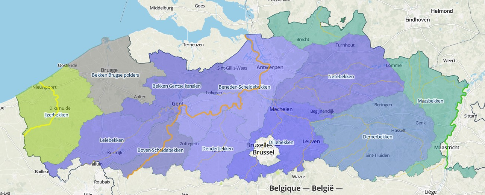

# VIS – A database on the distribution of fishes in inland and estuarine waters in Flanders, Belgium

Jan Breine[^1], Gerlinde Van Thuyne[^1], Hugo Verreycken[^1], Tom De Boeck[^2], Peter Desmet[^2], Claude Belpaire[^1] & Dimitri Brosens[^2]

[^1]: Research Institute for Nature and Forest (INBO), Duboislaan 14, 1560, Groenendaal, Belgium

[^2]: Research Institute for Nature and Forest (INBO), Kliniekstraat 25, 1070, Brussels, Belgium

*Corresponding authors: inland waters: Gerlinde Van Thuyne (gerlinde.vanthuyne@inbo.be), estuarine waters: Jan Breine (jan.breine@inbo.be)* 

---

Received {date} | Revised {date} | Accepted {date} | Published {date}

---

**Citation**: Combination of authors, year of data paper publication (in parentheses), Title, Journal Name, Volume, Issue number (in parentheses), and doi of the data paper.

---

**Resource Citation**: Research Institute for nature and Forest (INBO) (2014). VIS – A database on the distribution of fishes in inland and estuarine waters in Flanders, Belgium, +350.000 records. Contributed by Brosens D, Belpaire C, Van Thyne G, Breine J, De Boeck T, Desmet P and Verreycken H. Online at <http://dataset.inbo.be/vis-inland-occurrences> and <http://dataset.inbo.be/vis-estuarine-occurrences>. Version 1.0 (last updated on 2014-07-03), GBIF keys: [823dc56e-f987-495c-98bf-43318719e30f](http://www.gbif.org/dataset/823dc56e-f987-495c-98bf-43318719e30f) and [274a36be-0626-41c1-a757-3064e05811a4](http://www.gbif.org/dataset/274a36be-0626-41c1-a757-3064e05811a4). Data paper ID: doi: $$$$$$$

## Abstract

The Research Institute for Nature and Forest (INBO) has been performing standardized fish stock assessments in Flanders, Belgium since 1992. Within this Flemish Fish Monitoring Network, which aims to assess fish populations in public waters at regular time intervals, both inland waters and estuaries were monitored, mainly from March to November (Verreycken et al., 2011). This monitoring was set up in support of the Water Framework Directive, the Habitat Directive, the Eel Regulation, the Red List of fishes, fish stock management, biodiversity research, and to assess the colonization and spreading of non-native fish species. The collected data are consolidated in the Fish Information System or [VIS](http://vis.milieuinfo.be). From VIS, the occurrence data are now published at the [INBO IPT](http://data.inbo.be/ipt) as two datasets: ‘[VIS - Fishes in inland waters in Flanders, Belgium](http://dataset.inbo.be/vis-inland-occurrences)’ and ‘[VIS - Fishes in estuarine waters in Flanders, Belgium](http://dataset.inbo.be/vis-estuarine-occurrences)’. Together these datasets represent a complete overview of the distribution and abundance of fish species pertaining in Flanders from late 1992 to the end of 2012 (figure 1). This data paper discusses both datasets together, as both have a similar methodology and structure. The inland waters dataset contains over 350,000 fish observations, sampled between 1992 and 2012 from over 2,000 locations in inland rivers, streams, canals, and enclosed waters in Flanders. The dataset includes over 64 fish species, as well as a number of non-target species (mainly crustaceans). The estuarine waters dataset contains over 70,000 fish observations, sampled between 1995 and 2012 from almost 50 locations in the estuaries of the rivers Yser and Scheldt (“Zeeschelde”), including two sampling sites in the Netherlands. The dataset includes 116 fish species and a number of non-target crustacean species. To foster broad and collaborative use, the data are dedicated to the public domain under a [Creative Commons Zero waiver](http://creativecommons.org/publicdomain/zero/1.0/) and reference the [INBO norms for data use](https://github.com/LifeWatchINBO/norms-for-data-use).

*Figure 1: Map of all the VIS sampling locations. Orange points represent inland waters, green point respresent estuarine waters.*

## Keywords

Ecosystem functioning, fish-based index of biotic integrity, fish distribution, freshwater, brackish water, estuary, VIS, LifeWatch, open data, occurrence, observation, River Scheldt, River Yser, River Meuse

## Data published through

The occurrence datasets are available at: 

### VIS - Fishes in inland waters in Flanders, Belgium

* Source: <http://dataset.inbo.be/vis-inland-occurrences>
* GBIF: <http://www.gbif.org/dataset/823dc56e-f987-495c-98bf-43318719e30f>

### VIS - Fishes in estuarine waters in Flanders, Belgium

* Source: <http://dataset.inbo.be/vis-estuarine-occurrences>
* GBIF: <http://www.gbif.org/dataset/274a36be-0626-41c1-a757-3064e05811a4>

Reports (only in Dutch) can be generated and downloaded from: <http://vis.milieuinfo.be/publicaties/rapporten-afvissingen>

## Rationale

The Fish Information System or [VIS](http://vis.milieuinfo.be) (figure 2) is a database set up by the Research Institute for Nature and Forest (INBO) to monitor the status of fishes and their habitats in Flanders, Belgium and to calculate the biotic integrity (Karr, 1981, Belpaire et al., 2000 & Breine et al., 2004, 2007, 2007) of fish assemblages. It contains data regarding occurrences, individual morphometrics, stocks, pollutants, indices, and non-native fish species. Sampling has been going on since 1992, the database model was designed in 1994 (Verbiest et al, 1994), the first database developed in 1996 (Verbiest et al, 1996), and the consolidated database set up in 2001. VIS is used for supporting NATURA 2000, an ecological network of protected areas in Europe and to calculate the EQR (Ecological Quality Ratio) in the framework of the EU Water Directive (Directive 2000/60/EC). Further, the database provides updated information for Flemish Red Lists of fishes and lampreys (Verreycken et al., 2014) and on the distribution status of non-native and invasive fish species. The data are also crucial in fish stock management and for reporting on the status of the European eel stock as required by the Eel Regulation (Council Regulation (EC) N° 1100/2007).

*Figure 2: the logo of VIS, the Fish Information System*

## Taxonomic coverage

The inland waters dataset contains 64 fish species reported from Flemish enclosed waters and watercourses (some of which are non-native or invasive species), as well as a number of non-target species (mainly crustaceans). This dataset also includes a number of typical brackish water fish species which sometimes can be found in inland water sites at proximity of the sea and/or behind the sluice gates. The class of Actinopterygii is best represented (63 species), along with one Petromyzontida (*Lampetra planeri*) and 7 crustaceans from the order Decapoda.
 
The estuarine waters dataset contains 116 fish species found in the estuaries of the River Yser and the River Scheldt, as well as 9 non-target crustacean species. The class of Actinopterygii is best represented (110 species), along with three Petromyzontida, and three Chondrichthyes. All the crustaceans in this dataset are from the order of the Decapoda.

### Taxonomic ranks for inland waters

**Kingdom**: *Animalia*

**Class**: *Actinopterygii*, **Orders**: *Mugiliformes, Osmeriformes, Atheriniformes, Clupeiformes, Gadiformes, Pleuronectiformes, Siluriformes, Salmoniformes, Scorpaeniformes, Esociformes, Anguilliformes, Gasterosteiformes, Perciformes, Cypriniformes*, **Families**: *Anguillidae, Atherinidae, Centrarchidae, Clariidae, Clupeidae, Cobitidae, Cottidae, Cyprinidae, Esocidae, Gadidae, Gasterosteidae, Gobiidae, Ictaluridae, Lotidae, Moronidae, Mugilidae, Nemacheilidae, Osmeridae, Percidae, Petromyzontidae, Pleuronectidae, Salmonidae, Scophthalmidae, Siluridae, Soleidae, Umbridae*

**Class**: *Petromyzontida*, **Order**: *Petromyzontiformes*, **Family**: *Petromyzontidae*

**Class**: *Malacostraca*, **Order**: *Decapoda*, **Families**: *Atyidae, Cambaridae, Palaemonidae, Varunidae*

*Figure 3: Distribution of all occurrences from the inland waters dataset by order. Orders are ordered by number of occurrences, occurrences are displayed on a logarithmic scale.*

### Taxonomic ranks for estuarine waters

**Kingdom**: *Animalia*

**Class**: *Actinopterygii*, **Orders**: *Acipenseriformes, Anguilliformes, Atheriniformes, Beloniformes, Clupeiformes, Cypriniformes, Esociformes,Gadiformes, Gasterosteiformes, Mugiliformes, Osmeriformes, Perciformes, Pleuronectiformes, Salmoniformes, Scorpaeniformes, Siluriformes, Syngnathiformes*, **Families**: *Acipenseridae, Agonidae, Ammodytidae, Anguillidae, Atherinidae, Belonidae, Blenniidae, Bothidae, Callionymidae, Centrarchidae, Clupeidae, Cobitidae, Congridae, Cottidae, Cyclopteridae, Cyprinidae, Engraulidae, Esocidae, Gadidae, Gasterosteidae, Gobiidae, Ictaluridae, Liparidae, Lotidae, Moronidae, Mugilidae, Mullidae, Nemacheilidae, Smeridae, Percidae, Petromyzontidae, Pholidae, Pleuronectidae,Polybiidae, Salmonidae, Sciaenidae, Scombridae, Scophthalmidae, Siluridae, Soleidae, Syngnathidae, Trachinidae, Triglidae, Umbridae, Zoarcidae*

**Class**:*Chondrichthyes*, **Orders**: *Rajiformes, Squaliformes, Squatiniformes*, **Families**:*Squalidae, Squatinidae, Rajidae* 

**Class**:*Petromyzontida*, **Order**:*Petromyzontiformes*, **Family**:*Petromyzontidae*

**Class**:*Malacostraca*, **Order**:*Decapoda*, **Families**:*Cambaridae, Cancridae, Crangonidae, Paguridae, Palaemonidae, Polybiidae, Portunidae, Varunidae*

*Figure 4: Distribution of all occurrences from the estuarine waters dataset by order. Orders are ordered by number of occurrences, occurrences are displayed on a logarithmic scale.*

## Geographic coverage

### Flanders

Flanders is one of the three administrative regions in the country of Belgium, located in the centre of Western Europe. The Flemish region is situated in the north of the country and covers an area of 13,522km² (44,29% of Belgium). The Belgian climate is maritime temperate, influenced by the North Sea and the Atlantic Ocean with significant precipitation in all seasons. The summer is moderate and the winters are mild. The two main geographical regions of Flanders are the coastal plain in the North-West and the Central plain, further inland. With 470 inhabitants/km², Flanders is one of the most densely populated areas of Europe. The three major rivers are the River Yser, the River Scheldt, and the River Meuse. All rivers in Flanders flow into the North Sea, but only the River Yser drains directly into the sea within the jurisdiction of Flanders.

*Figure 5: Flanders is an administrative region of Belgium, located in the centre of Western Europe. [Image](http://commons.wikimedia.org/wiki/File:Flemish_Community_in_Belgium_and_Europe.svg) by [Alphatron](http://commons.wikimedia.org/wiki/User:Alphathon) derived from [Blank_map_of_Europe.svg](http://commons.wikimedia.org/wiki/File:Blank_map_of_Europe.svg), licensed under [CC BY-SA 3.0](http://creativecommons.org/licenses/by-sa/3.0).*
 
### Inland waters

The inland waters dataset comprises enclosed waters, including cut off river arms, gravel pits, ponds, natural lakes, and artificial lakes; and riverine habitats, including head streams, tributaries, and canals part of the drainage basins of the rivers Yser, Meuse, and Scheldt (figure 6). These three drainage basins are divided into eleven Flemish river catchments, which are divided into 102 subbasins. Overall, there are 48 unique enclosed waters sampled at 792 locations and 419 streams and rivers sampled at 1,452 locations.

*Figure 6: Drainages of the Rivers Yser (light green in west), Scheldt (blue), and Meuse (green in east) are divided in 11 Flemish subbasins. The grey area drains directly to the sea.*

### Estuarine waters

The estuarine waters dataset comprises the estuaries of the River Scheldt, including estuarine parts of the rivers Rupel, Durme, Zenne, Dijle and Grote Nete and the River Yser.

#### River Scheldt

The River Scheldt is a 435km long lowland river originating on the plateau of Saint-Quentin near Gouy, a small town in the French department of Aisne. The river enters Belgium close to Tournai. Then the river turns east, in the direction of Antwerp. After crossing the city of Antwerp, the Scheldt enters the Netherlands where it ends in the North Sea near Vlissingen. The tidal influence extends much further land inward than the freshwater-saltwater boundary. As a result, an extensive freshwater region under tidal influence is present. The tidal activity goes as far as Ghent (figure 7), 160km from the river mouth, where the tide is stopped by sluices. In the Zeeschelde (the Belgian part of the estuary), three zones are distinguished following the Venice system (1959): a mesohaline zone (5-18 g salt/kg) between Zandvliet and Antwerp, an oligohaline zone (0.5-5 g salt/kg) between Antwerp and Temse, including the Rupel tributary, and a tidal freshwater zone till Ghent including the Durme tributary. The marshes and mudflats create a valuable landscape for biodiversity.

*Figure 7: Areal foto of the Scheldt estuary. Sampling locations are marked in blue*

The Scheldt estuary is one of the last natural deltas in Western Europe and many areas near its riverbanks are marked as Natura 2000 areas (figure 8). Especially its freshwater estuary areas are unique.

*Figure 8: Natura 2000 areas near the riverbanks of the River Scheldt.*

#### River Yser

The River Yser is a 78km long river originating in Kassel, located in French Flanders. It enters Belgium in the province of West Flanders and drains into the sea near the town of Nieuwpoort. Sea and fresh water meet in an estuary, resulting in 130 hectares of tidal mud flats, salt marshes, dunes, beaches, and polders (figure 9). 

*Figure 9: The sampling locations in the Yser estuary.*

### Bounding box for covered area

Flanders: 50.68 to 51.51 latitude, 2.54 to 5.92 longitude.

## Temporal coverage

1992-12-15 - 2012-11-27

## Dataset

### Dataset description

The occurrence data from the VIS database are extracted, standardized, and published as two separate Darwin Core Archives: one for inland waters and one for estuarine species. The main rationale behind this is that both datasets cover different habitats, differ in sampling strategies and methods, and are curated by different scientists. Nevertheless the data model used for inland waters and estuarine waters is identical and can be easily merged: together these datasets represent a complete overview of fish distribution in Flanders from late 1992 to the end of 2012. In 2013 a new set of sampling locations was defined and the data collected since then is momentarily only available upon request.

The data are standardized to Darwin Core with a custom SQL view (figure 10) on the original VIS database. The Darwin Core terms (<http://rs.tdwg.org/dwc/terms/>) in the dataset at the time of publication are: `occurrenceID`, `type`, `language`, `rights`, `rightsholder`, `datasetID`, `institutionCode`, `collectionCode`, `datasetName`, `ownerInstitutionCode`, `basisOfRecord`, `informationWithheld`, `catalogNumber`, `recordedBy`, `individualCount`, `samplingProtocol`, `samplingEffort`, `eventDate`, `habitat`, `locationID`, `continent`, `waterBody`, `countryCode`, `verbatimLocality`, `verbatimLatitude`, `verbatimLongitude`, `verbatimCoordinateSystem`, `verbatimSRS`, `decimalLatitude`, `decimalLongitude`, `geodeticDatum`, `coordinateUncertaintyInMeters`, `identifiedBy`, `scientificName`, `kingdom`, `taxonRank`, `scientificNameAuthorship`, `vernacularName`, and `nomenclaturalCode`.

The data are dedicated to the public domain under a [Creative Commons Zero waiver](http://creativecommons.org/publicdomain/zero/1.0/). We would appreciate it if you follow our [norms for data use](https://github.com/LifeWatchINBO/norms-for-data-use) and notify the corresponding authors of the respective dataset if you use the data, especially for research purposes.

*Figure 10: Preview of the Darwin Core SQL view of the inland waters dataset.*

#### Inland waters dataset

* **Object name**: VIS - Fishes in inland waters in Flanders, Belgium
* **Character encoding**: UTF-8
* **Format name**: Darwin Core Archive format
* **Format version**: 1.0
* **Distribution**: http://dataset.inbo.be/vis-inland-occurrences
* **Publication date of data**: 2013-12-20
* **Language**: English
* **Licenses of use**: http://creativecommons.org/publicdomain/zero/1.0/ & https://github.com/LifeWatchINBO/norms-for-data-use
* **Metadata language**: English
* **Date of metadata creation**: 2013-12-20
* **Hierarchy level**: Dataset

#### Estuarine waters dataset

* **Object name**: VIS - Fishes in estuarine waters in Flanders, Belgium
* **Character encoding**: UTF-8
* **Format name**: Darwin Core Archive format
* **Format version**: 1.0
* **Distribution**: http://dataset.inbo.be/vis-estuarine-occurrences
* **Publication date of data**: 2014-04-02
* **Language**: English
* **Licenses of use**: http://creativecommons.org/publicdomain/zero/1.0/ & https://github.com/LifeWatchINBO/norms-for-data-use
* **Metadata language**: English
* **Date of metadata creation**: 2014-04-02
* **Hierarchy level**: Dataset

### Additional information

Length and weight measurement data of the individual fishes, absence information, occurrence data since 2013, as well as abiotic data of the sampling points (pH, temperature, etc.) are not included in the Darwin Core Archives and are available upon request.

## Methodology

### Study extent description

Over 2,000 locations in estuaries, inland rivers, streams, canals, and enclosed waters in Flanders, Belgium have been sampled since 1992. In 2001, these locations were consolidated in a monitoring network ("VISmeetnet") of 900 sampling points. Four locations in the Yser estuary and 43 locations in the Scheldt were sampled since 1995. While the Yser estuary only covers a small geographical area, the Scheldt estuary is with 33,000 hectares one of the largest estuaries in Europe. It is also one of the few remaining European estuaries that includes the entire gradient from fresh to saltwater tidal areas (Van den Bergh et al., 2009). The 43 sampling locations in the Scheldt estuary are mainly located in the River Scheldt, but also in the Rivers Durme, Rupel, Dijle, Zenne and Nete.

The geographic coordinates in both the datasets are those of the sampling locations (`dwc:locationID`). Since these do not always represent the actual coordinates of the catch, which may be located further up- or downriver, the coordinate uncertainty (`dwc:coordinateUncertaintyInMeters`) has been set to 250 meter.

### Sampling description

Sampling methods in inland waters are standardized and described in Belpaire et al., 2000 and Van Thuyne, 2010 and are indicated in the data as `dwc:samplingProtocol`. Per water body, the same method was used for each sampling event. The default method is electric fishing, but additional techniques such as gill nets, fykes, and seine netting (variable sizes) were used as well. Electric fishing was carried out using a 5kW generator with an adjustable output voltage of 300-500V and a pulse frequency of 480Hz. The number of electric fishing devices and hand-held anodes used depends on the river width (Belpaire et al., 2000). In riverine environments, electric fishing was carried out on both riverbanks in upstream direction. All fishes were identified to species level, counted, and measured for length and weight.

The default method used in estuarine waters is paired fyke netting, but additional techniques such as anchor netting, seine netting, pound netting, electric fishing, and eel fyke netting were used as well (Breine et al., 2011). All fishes were identified to species level, counted, and measured for length and weight.

### Quality control description

Strict field protocols where used. The Manual for Application of the European Fish Index (EFI) (Fame consortium, 2004) was used as a guideline for electrofishing and used in support of the EU water framework directive.

Users of the data can report issues with the inland waters and estuarine waters dataset at <https://github.com/LifeWatchINBO/vis-inland-occurrences> and <https://github.com/LifeWatchINBO/vis-estuarine-occurrences> respectively.

### Method step description

Water type | Method | Effort
:--- | :---| :---
Running freshwaters (width: 1.5m, depth: <1.30m) | electrofishing with 1 anode by wading | 100m
Running freshwaters (width: 6m, depth: <1.30m) | electrofishing with 2 anodes by wading | 100m
Running freshwaters (width: >6m, depth: <1.30m) | electrofishing with 2 anodes by wading | 250m with 1 anode on each riverbank, 2m from bank
Running freshwaters, streaming rivers (width: >6m, depth: >1.30m) | electrofishing with 2 anodes by boat | 250m with 2 anodes on each riverbank, 2m from bank
Canals, slowly running rivers (width: >6m, depth: >1.30m) | electrofishing with 2 anodes by boat AND 2 fykes | 250m with 2 anodes on each riverbank, 2m from bank AND 1 fyke for 48 hours parallel with and on both riverbanks
Canalized rivers with too high conductivity for electrofishing (depth: <1.30m) | seine netting | 100m, two times complete seine netting
Lakes | electric fishing AND fykes | 15% of riverbank (minimum 1000m, maximum 2000m) or 100% if perimeter is less than 1000m AND 1 fyke/hectare (minimum 4, maximum 20 fykes)
Estuaries | fyke fishing, anchor netting, pound netting, electric fishing | Fykes: 2 paired nets for two successive days per site. Winged fyke: one per site for two successive days. Anchor netting: per site 4 surveys of one hour (two for each tide). Electric fishing: only in flood control areas (250m shore transects/ha).

## Project data

### Project title

VIS - Fish Information System

### Personnel

* **Principal investigator**: Hugo Verreycken, Jan Breine, Gerlinde Van Thuyne
* **Resource contact, resource creator, metadata provider, point of contact**: Gerlinde Van Thuyne (inland Waters), Jan Breine (estuarine Waters)
* **Content providers**: Daniel Bombaerts, Jan Breine, Jean-Pierre Croonen, Adinda De Bruyn, Franky Dens, Marc De Wit, Linde Galle, Isabel Lambeens, Yves Maes, Gerlinde Van Thuyne
* **Developer**: Tom De Boeck
* **Processors**: Dimitri Brosens, Peter Desmet

### Funding

Flemish government

# References cited within the metadata

Belpaire C, Smolders R, Vanden Auweele I, Erecken D, Breine J, Van Thuyne G, Ollevier F (2000) An Index of Biotic Integrity characterizing fish populations and the ecological quality of Flandrian water bodies, Hydrobiologia, 434: 17-33, 2000.

Breine, J, Maes, J., Ollevier F, Stevens M (2011) Fish assemblages across a salinity gradient in the Zeeschelde estuary (Belgium). Belgian Journal of Zoologie, 141 (2): 21-44.

Breine JJ, Maes J, Quataert P, Van den Bergh E, Simoens I, Van Thuyne G, Belpaire C (2007) A fish-based assessment tool for the ecological quality of the brackish Schelde estuary in Flanders (Belgium). Hydrobiologia, 575: 141-159.

Breine J, Simoens I, Goethals P, Quataert P, Ercken D, Van Liefferinghe C, Belpaire C (2004) A fish-based index of biotic integrity for upstream brooks in Flanders (Belgium). Hydrobiologia, 522: 133-148.

European Commission (2007) Council Regulation (EC) No 1100/2007 of 18 September 2007 establishing measures for the recovery of the stock of European eel. Official Journal of the European Union 22.9.2007 L, 248: 17-23.

EU Water Framework Directive (2000) Directive 2000/60/EC of the European Parliament and of the Council of 23 October 2000 establishing a framework for Community action in the field of water policy Official Journal L 327 , 22/12/2000 P. 0001 - 0073

FAME Consortium (2004) Manual for the application of the European Fish Index - EFI. A fish-based method to assess the ecological status of European rivers in support of the Water Framework Directive. Version 1.1, January 2005.

Karr JR (1981) Assessment of biotic integrity using fish communities. Fisheries, 6: 21-27.
Van den Bergh E, Garniel G, Morris RKA, Barendregt A (2009) Conservation of tidal freshwater wetlands in Europe. Chapter 22: 241-252. In: Barendregt A, Whigham D, Baldwin A Eds Tidal Freshwater Wetlands (2009). Backhuys Publishers, Leiden, The Netherlands. 320 pp.

Van Thuyne G, Breine J (2010) Visbestandopnames in Vlaamse beken en rivieren in het kader van het 'Meetnet Zoetwatervis' 2009. Rapporten van het Instituut voor Natuur- en Bosonderzoek, 2010 (42). INBO: Brussel. 196 pp.

Venice system (1959) The final resolution of the symposium on the classification of brackish waters. Archo Oceanography Limnology, 11 (suppl): 243-248. <http://www.aslo.org/lo/toc/vol_3/issue_3/0346.pdf>

Verreycken H, Belpaire C, Van Thuyne G, Breine J, Buysse D, Coeck J, Mouton A, Stevens M, Van den Neucker T, De Bruyn L, Maes D (2014) IUCN Red List of freshwater fishes and lampreys in Flanders (north Belgium). Fisheries Management and Ecology, 21: 122-132. doi: 10.1111/fme.12052.

Verreycken H, Van Thuyne G, Belpaire C (2011) Length-weight relationships of 40 freshwater fish species from two decades of monitoring in Flanders (Belgium). Journal of Applied Ichthyology, 27: 1416–1421.

# Publications based on this dataset

Adriaenssens V, Goethals P, Breine J, Maes J, Simoens I, Ercken D, Belpaire C, Ollevier F, De Pauw N (2002) Referenties voor een visindex. Landschap, 19 (1): 59-61.

Adriaenssens V, Goethals P, De Pauw N, Breine J, Simoens I, Belpaire C, Maes J, Ercken D, Ollevier F (2002) Ontwikkeling van een estuariene visindex in Vlaanderen. Water, 2: 1-13.

Bervoets L, Goemans G, Belpaire C, Van den Boeck H, De Boeck G, De Jonge M, Van Thuyne G, Breine J, Joosen S, Van De Vijver B, Ningtias P, De Temmerman L, De Cooman W (2007) Ecologische en Ecotoxicologische toestand van de Dommel vóór de sanering van de waterbodem. Statusrapport 1, 60 pp + bijlagen.

Breine J, Belpaire C (1999) Waterverontreiniging. Visindex. MIRA-T 1999. Milieu-en natuurrapport Vlaanderen: Wetenschappelijke rapporten. IBW.Wb.BR.99.39.

Breine JJ, Goethals P, Simoens I, Ercken D, Van Liefferinghe C, Verhaegen G, Belpaire C, De Pauw N, Meire P, Ollevier F (2001) De visindex als instrument voor het meten van de biotische integriteit van de Vlaamse binnenwateren. Instituut voor Bosbouw en Wildbeheer, Groenendaal. Eindverslag van project VLINA 9901, studie uitgevoerd voor rekening van de Vlaamse Gemeenschap binnen het kader van het Vlaams Impulsprogramma Natuurontwikkeling. 173 pp. + bijlagen.

Breine J, Maes J, Ollevier F, Stevens M (2011) Fish assemblages across a salinity gradient in the Zeeschelde estuary (Belgium). Belgian Journal of Zoology, 141 (2): 21-44.

Breine JJ, Maes J, Quataert P, Van den Bergh E, Simoens I, Van Thuyne G, Belpaire C (2007) A fish-based assessment tool for the ecological quality of the brackish Schelde estuary in Flanders (Belgium). Hydrobiologia, 575: 141-159.

Breine J, Maes J, Stevens M, Simoens I, Elliott M, Hemingway K, Van den Bergh E (2008) Habitat needs to realise conservation goals for fish in estuaries: case study of the tidal Schelde. INBO.R.2008.3. 44 pp.

Breine J, Maes, Y, Van Thuyne G (2005) Visbestandopnames op de Grensmaas. IBW.Wb.V.R.2005.139. Depotnummer: D/2005/3241/227.

Breine J, Mertens W, Simoens I, Van Thuyne G (2010) Visbestandopnames op enkele wateren in het bekken van de Zeeschelde (2009). Rapporten van het Instituut voor Natuur- en Bosonderzoek 2010. (INBO.R.2010.18), 37 pp.

Breine J, Quataert P, Stevens M, Ollevier F, Volckaert FAM, Van den Bergh E, Maes J (2010) A zone-specific fish-based biotic index as a management tool for the Zeeschelde estuary (Belgium) Marine Pollution bulletin, 60: 1099-1112.

Breine J, Simoens I, Stevens M, Van Thuyne G (2007) Visbestandopnames op de Rupel en Durme (2007). Rapporten van het Instituut voor Natuur- en Bosonderzoek, 2007(24). Instituut voor Natuur- en Bosonderzoek: Groenendaal: Belgium. 11 pp.

Breine JJ, Simoens I, Van Thuyne G (2004) Visbestandopnames in enkele waterlopen in het Netebekken, 2003. IBW.Wb.V.R.2004.103.
Breine J, Simoens I, Van Thuyne G (2006) Visbestandopnames op de Rupel en de Durme (2006). D/2006/3241/100. 10 pp.

Breine JJ, Smolders R, Beyens J, Van Thuyne G, Belpaire C (1999) Visbestandopnames op de Warmbeek. IBW.Wb.V.R.99.078.

Breine J, Stevens M (2007) Monitoring van het visbestand in de Zeeschelde. Natuurpunt Klein-Brabant. 6de jaargang oktober 2007.

Breine J, Stevens M, Van den Bergh E, Maes J (2011) A reference list of fish species for a heavily modified transitional water: The Zeeschelde (Belgium). Belgian Journal of Zoology, 141 (1): 44-55.

Breine J, Stevens M, Van Thuyne G (2011) Opvolging van het visbestand van de Zeeschelde: resultaten voor 2010. INBO.R. 2011.4. 39 pp.

Breine J, Stevens M, Van Thuyne G (2011) Visbestandopnames op de Rupel en Durme (2008-2010). INBO.R. 2011.19. 19 pp.

Breine J, Stevens M, Van Thuyne G, Belpaire C (2010) Opvolging van het visbestand van de Zeeschelde: resultaten voor 2008-2009. INBO.R. 2010.13. Rapporten van het Instituut voor Natuur- en Bosonderzoek 2010 (INBO.R.2010.13). Instituut voor Natuur- en Bosonderzoek, Brussel. 34 pp.

Breine J, Van Hecke E (2007) Duurzame bevissing door medebeheer. Fishery Information Management Systems Video Productions: [s.l.]. 24 pp.

Breine JJ, Van Thuyne G (2004) Visbestandopnames op de Rupel en Durme (2004). IBW.Wb.V.R.2004.109. Depotnummer: D/2004/3241/197.

Breine JJ, Van Thuyne G (2005) Visbestandopnames in het Demerbekken (2005). IBW.Wb.V.R.2005.143. Depotnummer: D/2005/3241/226.

Breine JJ, Van Thuyne G (2005) Visbestandopnames op de Rupel en de Durme (2005). IBW.Wb.V.R.2005.147. Depotnummer: D/2005/3241/233.

Breine J, Van Thuyne G (2012) Opvolging van het visbestand van de Zeeschelde: resultaten voor 2011. INBO.R. 2012.24. 47 pp.

Breine JJ, Van Thuyne G (2012) Visbestandopnames in de getijgebonden Dijle en Beneden Nete. INBO.R.2012.32. 25 pp.

Breine J, Van Thuyne G (2012) Visbestandopnames op de Rupel en de Durme (2011). INBO.R. 2012.33. 25 pp.

Breine J, Van Thuyne G (2012) Visbestandopnames in de getijgebonden Zenne. Viscampagne 2011. INBO.R. 2012.34. 19 pp.

Breine J, Van Thuyne G (2012) Visbestandopnames in het Lippenbroek, een gecontroleerd overstromingsgebied met gereduceerd getij in het Zeeschelde-estuarium: Viscampagnes 2006-2012. INBO.R. 2012.67. 66 pp.

Breine J, Van Thuyne G (2013) Het visbestand in het IJzerestuarium: viscampagnes 2008-2012. INBO.R.2013.8. 61 pp.

Breine J, Van Thuyne G (2013) Opvolgen van het visbestand van het Zeeschelde-estuarium. Viscampagne 2012. INBO.R.2013.13. 64 pp.

Breine J, Van Thuyne G (2013) Opvolgen van het visbestand van het Zeeschelde-estuarium met ankerkuilvisserij. Resultaten voor 2013. INBO.R.2013.1020474. 38 pp.

Breine JJ, Van Thuyne G, Belpaire C (1999) Visbestandopnames op de Demer en de Laambeek. IBW.Wb.V.R.99.071.

Breine JJ, Van Thuyne G, Belpaire C (2000) Het Visbestand in de Voer, Vlaams-Brabant (november, 1999). IBW.Wb.V.IR.2000.86.

Breine JJ, Van Thuyne G, Belpaire C (2011) Visbestandopnames in de Zenne stroomafwaarts Brussel 2007-2010. INBO.R.2011.10. 19 pp.

Breine JJ, Van Thuyne G, Belpaire C, Beyens J (1999) Visbestandopnames op de Abeek. IBW.Wb.V.R.99.076.

Breine JJ, Van Thuyne G, Belpaire C, De Charleroy D, Beyens J (1999) Het visbestand in de Demer anno 1999. IBW.Wb.V.R..99.069. 44 pp.

Breine JJ, Van Thuyne G, Beyens J, Belpaire C (1999) Visbestandopnames op de Grensmaas. IBW.Wb.V.R.99.080.

Breine JJ, Van Thuyne G, Beyens J, Smolders R, Belpaire C (1999) Visbestandopnames op de Berwijn. IBW.Wb.V.R.99.077.

Breine JJ, Van Thuyne G, Beyens J, Smolders R, Belpaire C (1999) Visbestandopnames op de Dommel. IBW.Wb.V.R.99.079.

Breine JJ, Van Thuyne G, De Bruyn L (2012) Opvolging van het visbestand van de Zeeschelde met ankerkuilvisserij: resultaten voor 2012. INBO.R. 2012.38. Rapporten van het Instituut voor Natuur- en Bosonderzoek 2012 (INBO.R.2012.38). 54 pp.

Breine JJ, Verreycken H (2005) Moet er nog vis zijn? Een kijk onder water in het Denderbekken. In: Dendriet 3/2005. 3-7.

Cammaerts R, Spikmans F, Van Kessel N, Verreycken H, Chérot F, Demol T, Dmol S (2011) Colonization of the Border Meuse area (The Netherlands and Belgium) by the non-native western tubenose goby Proterorhinus semilunaris (Heckel, 1837) (Teleostei, Gobiidae). Aquatic Invasions, 7: 251–258.

Cuveliers E, Stevens M, Guelinckx J, Ollevier F, Breine J, Belpaire C (2007) Opvolging van het visbestand van de Zeeschelde: resultaten voor 2006. Studierapport in opdracht van het Instituut voor Natuur- en Bosonderzoek. INBO.R.2007.48. 42 pp.

De Cooman W, Maeckelberghe H, Vos G, De Corte S, Van Erdeghem M, Van Wauwe P, Vannevel R, Belpaire C, Breine JJ, Schneiders A, Peeters B (2002) Kwaliteit oppervlaktewater. In: MIRA-T 2002. Milieu- en natuurrapport Vlaanderen: thema’s. VMM. 289-297.

De Pauw N, Maeckelberghe H, Belpaire C, Breine JJ, De Cooman W, Florus M (1999) Kwaliteit van het oppervlaktewater. In Verbruggen (ed.). Milieu- en Natuurrapport Vlaanderen: Thema’s Mira-T 1999. Garant, Kessel-Lo. 313-332.

Elliott M, Hemingway KL, Cutts ND, Burdon D, Perez-Dominquez R, Allen JH, Thomson SM, de Jonge V, Breine J, Van den Bergh E, Stevens M, Simoens I, Jager Z, Twisk F (2008) Estuarine ecosystem functioning, restoration and health. Final report (Harbasins WP2). 750 pp.

Elliott M, Marencic H, Breine J, Niemeyer H-D, Zijp F (2008) Harbasins, steps towards a harmonised transnational management strategy for coastal and transitional waters. Final report May 15th 2008. 48 pp.

Ercken D, Breine JJ, Simoens I, Van Liefferinghe P, Goethals P, Verhaegen G, Belpaire C, Ollevier F (2003) Invloed van RWZI’s op waterkwaliteit van IJse, Grote en Kleine Gete. Brakona jaarboek 2001 D/2003/8495/05. 56-62.

Goethals P, Breine J, Simoens I, Belpaire C (2006) Ontwikkelen van een index voor het biologisch kwaliteitselement vis voor de Kaderrichtlijn Water - Uittesten van de Europese ontwerphandleiding 'REFCOND' voor het kwaliteitselement vis in Vlaanderen, project nr.: VMM.AMO.KRW.ECO1.2002 IBW.Wb.V.R.2006.149. 79 pp.

Goudswaard PC, Breine J (2011) Kuilen en schieten in het Schelde-estuarium. Vergelijkend vissen op de Zeeschelde in België en Westerschelde in Nederland. Rapport C139/11, IMARES & INBO. 35 pp.

Guelinckx J, Cuveliers E, Stevens M, Ollevier F, Breine J, Belpaire C (2008) Opvolging van het visbestand van de Zeeschelde: resultaten voor 2007. Studierapport in opdracht van het Instituut voor Natuur- en Bosonderzoek. INBO.R.2008.39. 47 pp.

Maeckelberghe H, De Cooman W, Belpaire C, Breine JJ, Schneiders A, Mergaert K, Florus M, De Backer L, Vannevel R, Peeters B (2001) Kwaliteit oppervlaktewater in Mira-T 2001; Milieu- en Natuurrapport Vlaanderen. 405-419.

Maes J, Geysen B, Stevens M, Ollevier F, Breine J, Belpaire C (2005) Opvolging van het visbestand van de Zeeschelde: resultaten voor 2004. Studierapport in opdracht van het Instituut voor Bosbouw en Wildbeheer. Leuven. IBW.Wb.V.R.2005.149.

Maes J, Stevens M, Breine J (2007) Modelling the migration opportunities of diadromous fish species along a gradient of dissolved oxygen concentration in a European tidal watershed. Estuarine Coastal and Shelf Science, 75: 151-162.

Maes J, Stevens M, Breine J (2008) Poor water quality constrains the distribution and movements of twaite shad Alosa fallax fallax (Lacépède, 1803) in the watershed of river Scheldt. Hydrobiologia, 602: 129-143.

Mertens W, Van Thuyne G, Breine J (2010) Visbestandopnames op enkele wateren in de polder van Kruibeke - Bazel - Rupelmonde (2007-2008). Meting nulsituatie in het kader van de monitoring van het Sigmaplan. INBO.R.2010.10. 19 pp.

Quataert P, Verschelde P, Breine J, Verbeke G,. Goetghebeur E, Ollevier F (2011) A diagnostic modelling framework to construct indices of biotic integrity: A case study of fish in the Zeeschelde estuary (Belgium). Estuarine, Coastal and Shelf Science, 94: 222-233.

Schneiders A, Breine JJ, Simoens I (2001) Waterlopen. In: Kuijken et al. (2001) Natuurrapport 2001. Toestand van de natuur in Vlaanderen: cijfers voor het beleid. Mededeling van het Instituut voor Natuurbehoud nr. 18, Brussel. 69-79.

Schneiders A, Coeck J, Buysse D, Van Thuyne G, Belpaire C, Breine J (2003) Vissen en rondbekken. In Dumortier et al. (2003) Natuurrapport 2003. Toestand van de natuur in Vlaanderen: cijfers voor het beleid. Mededeling van het Instituut voor Natuurbehoud nr.21, Brussel. 42-47.

Schneiders A, Spanhove T, Breine J, Zomlot Z, Verbeiren B, Batelaan O, Decleyre D (2014) Hoofdstuk 22 - Ecosysteemdienst regulering overstromingsrisico (INBO.R.2014.2001135). In Stevens M et al. (eds.), Natuurrapport - Toestand en trend van ecosystemen en ecosysteemdiensten in Vlaanderen. Technisch rapport. Mededelingen van het Instituut voor Natuur- en Bosonderzoek, INBO.M.2014.1988582, Brussel. 91 pp.

Schneiders A, Van Thuyne G, Breine J (2005) Vissen en rondbekken. In Dumortier et al., (2005) Natuurrapport 2005. Toestand van de natuur in Vlaanderen: cijfers voor het beleid. Mededeling van het Instituut voor Natuurbehoud nr.24, Brussel. 67-73.

Simoens I, Breine JJ, Belpaire C (2001) Vis die vandaag gevangen is. De Koerier. Limburgs Landschap vzw 29. N°2, 34-38.

Simoens I, Breine JJ, Van Liefferinge C, Stevens M, Belpaire C (2007) Het belang van het Lippenbroek als habitat voor vissen in de Zeeschelde, in: (2007). Congres Watersysteemkennis 2006/2007: Mogelijkheden voor ecologisch herstel van watersystemen. Water, 30: 68-71.

Simoens I, Breine JJ, Verreycken H, Belpaire C (2002) Fish stock assessment of Lake Schulen, Flanders. A comparison between 1988 and 1999. In Cowx IG (editor) Management and Ecology of Lake and Reservoir Fisheries. Fishing News Books, Blackwell Science. 404 pp.

Simoens I, Breine JJ, Verreycken H, Belpaire C, Beyens J (2000) Vergelijkende studie van het visbestand in het Schulensmeer: 1988-1999. IBW.Wb.V.R.00.078. D/2000/3241/195. 86 pp.

Simons F, Goethals PLM, Breine JJ, Simoens I, Belpaire C (2002) Ontwikkelen van een index voor het biologisch kwaliteitselement vis voor de Kaderrichtlijn Water - Uittesten van de Europese ontwerphandleiding 'REFCOND' voor het kwaliteitselement vis in Vlaanderen: Deel 2: Overgangswater. 2002. IBW.Wb.V.R.2004.110.

Speybroeck J, Breine J, Vandevoorde B, Van Braeckel A, Van den Bergh E, Van Thuyne G (2008) KRW doelstellingen in de IJzermonding. Afleiden en beschrijven van typespecifiek maximaal ecologisch potentieel en goed ecologisch potentieel in het Vlaams waterlichaam ‘Havengeul IJzer’ vanuit de - overeenkomstig de Kaderrichtlijn Water - ontwikkelde relevante beoordelingssystemen voor een aantal biologische kwaliteitselementen. INBO.R.2008.55. D/2008/3241/388 VMM.AMO.KRW.IJZERMOND. 76 pp.

Speybroeck J, Breine J, Vandevoorde B, Van Wichelen J, Van Braeckel A, Van Burm E, Van den Bergh E, Van Thuyne G, Vijverman W (2008) KRW doelstellingen in Vlaamse getijrivieren. Afleiden en beschrijven van typespecifiek maximaal ecologisch potentieel en goed ecologisch potentieel in het Vlaams waterlichaam ‘Havengeul IJzer’ vanuit de - overeenkomstig de Kaderrichtlijn Water - ontwikkelde relevante beoordelingssystemen voor een aantal biologische kwaliteitselementen. INBO.R.2008.56. D/2008/3241/387 VMM.AMO.KRW.zoetgetij. 152 pp.

Stevens M, Breine J, Simoens I (2006) Spatial and temporal trends in the fish community of the Zeeschelde. Results from fyke catches in 2005. 29 pp.

Stevens M, Maes J, Guelinckx J, Ollevier F, Breine J, Belpaire C (2006) Opvolging van het visbestand van de Zeeschelde: resultaten voor 2005. Studierapport in opdracht van het Instituut voor Natuur- en Bosonderzoek. 33 pp.

Van Ael E, Belpaire C, Breine J, Geeraerts C, Van Thuyne G, Eulaers I, Blust R, Bervoets L (2014) Are persistent organic pollutants and metals in eel muscle predictive for the ecological water quality? Environmental pollution, 186: 165-171.

Van Daele T, Van den Bergh E, Maris T, Schneiders A, Breine J, Van Braeckel A (2007) Focus Zeeschelde, in: Dumortier et al. (Editors). Natuurrapport 2007: toestand van de natuur in Vlaanderen : cijfers voor het beleid. Mededelingen van het Instituut voor Natuur- en Bosonderzoek, 2007 (4): 264-280.

Van Liefferinge, C., Simoens, I., Vogt , C., Cox, T.J.S., Breine, J., Ercken, D., Goethals, P., Belpaire, C. & P. Meire, 2010. Impact of habitat diversity on the sampling effort required for the assessment of river fish communities and IBI. Hydrobiologia, 644: 169-183.

Van Ryckegem G, Breine J, De Regge N, Dillen J, Mertens W, Soors J, Speybroeck J, Terrie T, Vandevoorde B, Van Lierop F, Van Braeckel A, Van den Bergh E (2011) MONEOS – Geïntegreerd datarapport Toestand Zeeschelde tot 2009. Datarapportage ten behoeve van de VNSC voor het vastleggen van de uitgangssituatie anno 2009. INBO.R.2011.8. Brussel. 77 pp.

Van Ryckegem G, Breine J, De Regge N, Mertens W, Soors J, Speybroeck J, Terrie T, Vandevoorde B, Van Lierop F, Van Braeckel A, Van den Bergh E (2012) MONEOS – Geïntegreerd datarapport Toestand Zeeschelde INBO 2011. Monitoringsoverzicht en 1ste lijnsrapportage Geomorfologie, diversiteit Habitats en diversiteit Soorten. Rapport INBO.R.2012.20. 70 pp.

Van Ryckegem G, Breine J, De Regge N, Mertens W, Soors J, Speybroeck J, Terrie T, Vandevoorde B, Van Lierop F, Van Braeckel A, Van den Bergh E (2013) MONEOS – Geïntegreerd datarapport Toestand Zeeschelde INBO 2012. Monitoringsoverzicht en 1ste lijnsrapportage Geomorfologie, diversiteit Habitats en diversiteit Soorten. Rapport INBO.R.2013.26. 70 pp.

Van Thuyne G, Belpaire C, Breine JJ (2000) Visbestandmeetnet van het Instituut voor Bosbouw en Wildbeheer. In VMM. Waterkwaliteit-Lozingen in het water 1999. VMM, 2000.

Van Thuyne G, Beyens J. Breine JJ, Belpaire C (1998) Visbestandopnames op het Meer van Weerde. IBW.Wb.V.IR.2000.111.

Van Thuyne G, Breine J (2001) Visbestandopnames op enkele zijbeken van de Dender. IBW.Wb.V.IR.2001.117.

Van Thuyne G, Breine J (2001) Visbestandopnames op de Poppelse A en zijbeken, juni 2001. IBW.Wb.V.IR.2002.119.

Van Thuyne G, Breine J (2002) Visbestandopnames op enkele beken in het Netebekken. IBW.Wb.V.IR.2002.121.

Van Thuyne G, Breine J (2002) Visbestandopnames op de Grensmaas (mei 2002). IBW.Wb.V.IR.2002.125.

Van Thuyne G, Breine J (2002) Visbestandopnames op enkele zijbeken van de Leie (2002). IBW.Wb.V.IR.2002.127.

Van Thuyne G, Breine J (2003) Visbestandopnames op de Dender (maart 2002). IBW.Wb.V.IR.2003.129.

Van Thuyne G, Breine J (2003) Visbestanden op enkele zijlopen van de Bovenschelde (2002). IBW.Wb.V.IR.2003.130.

Van Thuyne G, Breine J (2003) Visbestanden op enkele beken in het Dijlebekken (2002). IBW.Wb.V.IR.2003.132.

Van Thuyne G, Breine J (2003) Visbestanden op enkele beken in het Maasbekken (2002). IBW.Wb.V.IR.2003.133.

Van Thuyne G, Breine J (2003) Visbestanden op enkele zijbeken van de Dender (2002). IBW.Wb.V.IR.2003.135.

Van Thuyne G, Breine J (2003) Visbestanden op enkele waterlopen van het IJzerbekken (2002). IBW.Wb.V.IR.2003.137.

Van Thuyne G, Breine J (2003) Visbestanden op enkele waterlopen gelegen in het bekken van de Gentse Kanalen (2002). IBW.Wb.V.IR.2003.138.

Van Thuyne G, Breine J (2003) Visbestanden op het groot en het klein wachtbekken van de Zuunbeek, Vlaams Brabant (2002). IBW.Wb.V.IR.2003.141.

Van Thuyne G, Breine J (2003) Het visbestand in de Dijle (2003). IBW.Wb.V.IR.2003.145.

Van Thuyne G, Breine J (2003) Visbestanden in enkele beken van het Dijlebekken (2003). IBW.Wb.V.IR.2003.146.

Van Thuyne G, Breine J (2003) Visbestanden in enkele beken van het Maasbekken (2003). IBW.Wb.V.IR.2003.147.

Van Thuyne G, Breine J (2003) Visbestanden in de Motte en de Winge (2003). IBW.Wb.V.IR.2003.148.

Van Thuyne G, Breine J (2003) Visbestanden in enkele beken van het Netebekken (2003). IBW.Wb.V.IR.2003.149.

Van Thuyne G, Breine J (2003) Visbestanden in enkele zijbeken van de Leie (2003). IBW.Wb.V.IR.2003.150.

Van Thuyne G, Breine J (2003) Visbestandopnames in de Bovenschelde (2002). IBW.Wb.V.IR.2003.151.

Van Thuyne G, Breine J (2003) Visbestanden in de zijlopen van de Bovenschelde (2003). IBW.Wb.V.IR.2003.153.

Van Thuyne G, Breine J (2003) Het Visbestand van de Demer in Vlaams Brabant (2003). IBW. V.IR.2003.156.

Van Thuyne G, Breine J (2004)Visbestanden in enkele zijlopen van de Benedenschelde (2002 en 2003). IBW.Wb.V.R.2004.102.

Van Thuyne G, Breine J (2004) Visbestand op enkele waterlopen van de Brugse Polders (2003). IBW.Wb.V.R.2004.104.

Van Thuyne G, Breine J (2004) Visbestanden op de gracht van het Fort van Walem (2003). IBW.Wb.V.R.2004.106.

Van Thuyne G, Breine J (2004) Visbestandopnames op het Kanaal van Dessel naar Schoten (2003). IBW.Wb.V.R.2004.107. Depotnummer: D/2004/3241/192.

Van Thuyne G, Breine J (2004) Visbestandopnames op het Oud kanaal Bocholt en het Oud kanaal Bree-Beek (2003). IBW.Wb.V.R.2004.108. Depotnummer: D/2004/3241/195.

Van Thuyne G, Breine J (2004) Visbestandopnames op de Velpe en Begijnebeek (2004). IBW.Wb.V.R.2004.112. Depotnummer: D/2004/3241/214.

Van Thuyne G, Breine J (2004) Visbestandopnames op de Mark en zijbeken en de Kleine Aa of Wildertse beek (2004). IBW.Wb.V.R.2004.113. Depotnummer: D/2004/3241/215.

Van Thuyne G, Breine J (2004) Visbestandopnames op enkele beken van het Dijlebekken (2004). IBW.Wb.V.R.2004.114. Depotnummer: D/2004/3241/239.

Van Thuyne G, Breine J (2004) Visbestandopnames op enkele beken in het Netebekken (2004). IBW.Wb.V.R.2004.115. Depotnummer: D/2004/3241/230.

Van Thuyne G, Breine J (2004) Visbestandopnames op enkele zijbeken van de Bovenschelde (2004). IBW.Wb.V.R.2004.116. Depotnummer: D/2004/3241/231.

Van Thuyne G, Breine J (2004) Visbestandopnames op de Mark en enkele zijbeken (2004). IBW.Wb.V.R.2004.117. Depotnummer: D/2004/3241/232.

Van Thuyne G, Breine J (2004) Visbestanden op de Oude Maas Stokkem (2002). IBW.Wb.V.R.2004.119. Depotnummer: D/2004/3241/249.

Van Thuyne G, Breine J (2004) Visbestandopnames op de Abeek (2004). IBW.Wb.V.R.2004.120. Depotnummer: D/2004/3241/250.

Van Thuyne G, Breine J (2004) Visbestandopnames op het Ieperleed en het Lekevaartje (2004). IBW.Wb.V.R.2004.122. Depotnummer: D/2004/3241/281.

Van Thuyne G, Breine J (2004) Visbestandopnames op de Bellewaerdebeek, de Douvebeek (IJzerbekken), de Oude Mandel, de Krommedijkbeek en de Kalebeek (Leiebekken). IBW.Wb.V.R.2004.123. Depotnummer: D/2004/3241/280.

Van Thuyne G, Breine J (2004) Visbestandopnames op de Dommel en Warmbeek en hun zijbeken (2004). IBW.Wb.V.R.2004.124. Depotnummer: D/2004/3241/286.

Van Thuyne G, Breine J (2005) Visbestandopnames op de hengelvijver van het Webbekomsbroek te Webbekom (Diest) (2004). IBW.Wb.V.R.2005.130. Depotnummer D/2005/3241/016.

Van Thuyne G, Breine J (2005) Visbestandopnames op De Broeken, te Elen (2004). IBW.Wb.V.R.2005.131. Depotnummer D/2005/3241/031.

Van Thuyne G, Breine J (2005) Visbestandopnames op de Zuid-Willemsvaart (2004). IBW.Wb.V.R.2005.133. Depotnummer D/2005/3241/032.

Van Thuyne G, Breine J (2005) Visbestandopnames op enkele waterlopen gelegen in het bekken van de Gentse Kanalen. IBW.Wb.V.R.2005.138. Depotnummer: D/2005/3241/229.

Van Thuyne G, Breine J (2005) Visbestandopnames op de Itterbeek en zijbeken. IBW.Wb.V.R.2005.141. Depotnummer: D/2005/3241/228.
Van Thuyne G, Breine J (2007) Visbestandopnames op de Molenbeek-Markebeek en enkele zijbeken (2006). Rapporten van het Instituut voor Natuur- en Bosonderzoek, 2007 (4). Instituut voor Natuur- en Bosonderzoek: Brussel.

Van Thuyne G, Breine J (2007) Visbestandopnames op de Demer (2006). Rapporten van het Instituut voor Natuur- en Bosonderzoek, 2007 (10). Instituut voor Natuur- en Bosonderzoek: Groenendaal. 22 pp.

Van Thuyne G, Breine J (2007) Visbestandopnames op enkele beken in het bekken van de Benedenschelde (2006). Rapporten van het Instituut voor Natuur- en Bosonderzoek, 2007 (11). Instituut voor Natuur- en Bosonderzoek: Groenendaal. 21 pp.

Van Thuyne G, Breine J (2007) Visbestandopnames op de Poppelse AA en de Leyloop (2006). Rapporten van het Instituut voor Natuur- en Bosonderzoek, 2007 (12). Instituut voor Natuur- en Bosonderzoek: Groenendaal. 17.

Van Thuyne G, Breine J (2007) Visbestandopnames op de Lossing en zijbeken (2006). Rapporten van het Instituut voor Natuur- en Bosonderzoek, 2007 (15). Instituut voor Natuur- en Bosonderzoek: Groenendaal. 16 pp.

Van Thuyne G, Breine J (2007) Visbestandopnames op enkele beken gelegen in het Demerbekken (2006). Rapporten van het Instituut voor Natuur- en Bosonderzoek, 2007 (16). Instituut voor Natuur- en Bosonderzoek: Groenendaal. 22 pp.

Van Thuyne G, Breine J (2007) Visbestandopnames op enkele zijbeken van de Dender (2006). Rapporten van het Instituut voor Natuur- en Bosonderzoek, 2007 (17). Instituut voor Natuur- en Bosonderzoek: Groenendaal. 17 pp.

Van Thuyne G, Breine J (2007) Visbestandopnames op enkele zijlopen van de Dijle (2006). Rapporten van het Instituut voor Natuur- en Bosonderzoek, 2007 (18). Instituut voor Natuur- en Bosonderzoek: Groenendaal. 24 pp.

Van Thuyne G, Breine J (2007) Visbestandopnames op de Gaverbeek (2006). Rapporten van het Instituut voor Natuur- en Bosonderzoek, 2007 (19). Instituut voor Natuur- en Bosonderzoek: Groenendaal. 15 pp.

Van Thuyne G, Breine J (2007) Visbestandopnames op enkele zijbeken van de Leie (2006). Rapporten van het Instituut voor Natuur- en Bosonderzoek, 2007 (20). Instituut voor Natuur- en Bosonderzoek: Groenendaal. 16 pp.

Van Thuyne G, Breine J (2007) Visbestandopnames op de Grote Nete en de Grote Laak en enkele van zijn zijbeken (2006). Rapporten van het Instituut voor Natuur- en Bosonderzoek, 2007 (21). Instituut voor Natuur- en Bosonderzoek: Groenendaal. 23 pp.

Van Thuyne G, Breine J (2007). Visbestandopnames op enkele zijlopen van de Maas (2006). Rapporten van het Instituut voor Natuur- en Bosonderzoek, 2007(26). Instituut voor Natuur- en Bosonderzoek: Groenendaal. 18 pp.

Van Thuyne G, Breine J (2007) Visbestandopnames op het Dijlekanaal Leuven-Mechelen (2006). Rapporten van het Instituut voor Natuur- en Bosonderzoek, 2007 (33). Instituut voor Natuur- en Bosonderzoek: Groenendaal. 22 pp.

Van Thuyne G, Breine J (2007) Visbestandopnames op het Boudewijnkanaal. Rapporten van het Instituut voor Natuur- en Bosonderzoek, 2007 (34). Instituut voor Natuur- en Bosonderzoek: Groenendaal. 18 pp.

Van Thuyne G, Breine J (2008) Visbestandopnames in Vlaamse beken en rivieren afgevist in het kader van het 'Meetnet Zoetwatervis' 2007. Rapporten van het Instituut voor Natuur- en Bosonderzoek, 2008(21). Instituut voor Natuur- en Bosonderzoek: Groenendaal. 154 pp.

Van Thuyne G, Breine J (2009) Visbestandopnames in Vlaamse beken en rivieren in het kader van het 'Meetnet Zoetwatervis' 2008. Rapporten van het Instituut voor Natuur- en Bosonderzoek, R.2009.32. Instituut voor Natuur- en Bosonderzoek: Brussel. 197 pp.

Van Thuyne G, Breine J (2010) Het meetnet zoetwatervis, kleine modderkruiper en alver, thuis in de IJzer. 2010. Vislijn.

Van Thuyne G, Breine J (2011) Visbestandopnames in Vlaamse beken en rivieren in het kader van het 'Meetnet Zoetwatervis' 2010. Rapporten van het Instituut voor Natuur- en Bosonderzoek 2011 (INBO.R.2011.23). Instituut voor Natuur- en Bosonderzoek, Brussel.

Van Thuyne G, Breine J Belpaire C (2008) Visbestanden op de Dommel in het kader van de sanering van de bodem. Rapporten van het Instituut voor Natuur- en Bosonderzoek, 2008 (57). Instituut voor Natuur- en Bosonderzoek: Brussel. 48 pp.

Van Thuyne G, Breine J, Maes Y (2005) Visbestandopnames in het Maasbekken: de Voerstreek (2005). IBW.Wb.V.R.2005.142. Depotnummer: D/2005/3241/230.

Van Thuyne G, Breine J, Maes Y (2006) Visbestandopnames op het Galgenweel (2005). Rapporten van het instituut voor Bosbouw en Wildbeheer - sectie visserij, 2006 (153). Instituut voor Bosbouw en Wildbeheer.

Van Thuyne G, Breine J, Samsoen L (2004) Visbestandopnames op ’t Liefken, de Wagemakersbeek, de Burggravestroom, de Lede, Scherpeleibeek en de Eeklose watergang (2004). IBW.Wb.V.R.2004.125. Depotnummer: D/2004/3241/314.

Van Thuyne G, Breine J, Samsoen L (2004) Visbestandopnames op de E3 put te Oostakker (2003). IBW.Wb.V.R.2004.128. Depotnummer: D/2004/3241/317.

Van Thuyne G, Breine J, Vrielynck S (2005) Visbestandopnames op het Kanaal van Roeselare naar de Leie (2004). IBW.Wb.V.R.2005.132. Depotnummer D/2005/3241/026.

Van Thuyne G, Breine J, Vrielynck S. (2007) Visbestandopnames op de Poperingevaart en enkele waterlopen gelegen in het IJzerbekken. Rapporten van het Instituut voor Natuur- en Bosonderzoek, 2007 (42). Instituut voor Natuur- en Bosonderzoek: Groenendaal. 20 pp.

Van Thuyne G, Breine J, Vrielynck S (2007) Visbestandopnames op enkele waterlopen gelegen in de Brugse polders. Rapporten van het Instituut voor Natuur- en Bosonderzoek, 2007 (29). Instituut voor Natuur- en Bosonderzoek: Groenendaal. 23 pp.

Van Thuyne G, et al. (2006). Visbestandopnames op het Schipdonkkanaal (2005). Rapporten van het instituut voor bosbouw en wildbeheer - sectie visserij, 2006 (155). Instituut voor Bosbouw en Wildbeheer: Hoeilaart-Groenendaal. 12 pp.

Van Thuyne G, Gaethofs T, Breine J (2003) Het visbestand van de Zusterkloosterbeek (2003). IBW.Wb.V.IR.2003.154.
Van Thuyne G, Maes Y, Breine J (2005) Visbestandopnames in het Denderbekken, 2005. IBW.Wb.V.R.2005.144. Depotnummer: D/2005/3241/224.
Van Thuyne G, Maes Y, Breine J (2005) Visbestandopnames op de Dender, 2005. IBW.Wb.V.R.2005.145. Depotnummer: D/2005/3241/231.

Van Thuyne G, Maes Y, Breine J (2005) Visbestandopnames op de IJse, 2005. IBW.Wb.V.R.2005.146. Depotnummer: D/2005/3241/233.

Van Thuyne G, Maes Y, Breine J (2006) Visbestandopnames op het kanaal van Beverlo (2005). Rapporten van het instituut voor bosbouw en wildbeheer - sectie visserij, 2006 (151). Instituut voor Bosbouw en Wildbeheer: Groenendaal: Belgium. 11 pp.

Van Thuyne G, Samsoen L, Breine J (2004) Visbestand op de Moervaart en het Kanaal van Stekene (2003). IBW.Wb.V.R.2004.121. Depotnummer: D/2004/3241/251.

Van Thuyne G, Samsoen L, Breine J (2006) Visbestandopnames op de oude Leiearm te Grammene (2005). Rapporten van het instituut voor bosbouw en wildbeheer - sectie visserij, 2006 (154). Instituut voor Bosbouw en Wildbeheer: Groenendaal, Belgium. 16 pp.

Van Thuyne G, Samsoen L, Breine J (2006) Visbestandopnames op de Oude Durme (2005). Rapporten van het instituut voor bosbouw en wildbeheer - sectie visserij, 2006 (156). Instituut voor Bosbouw en Wildbeheer: Groenendaal-Hoeilaart. 16 pp.

Van Thuyne G, Samsoen L, Breine J (2007) Visbestandopnames op de Bovenschelde. Rapporten van het Instituut voor Natuur- en Bosonderzoek, 2007 (25). Instituut voor Natuur- en Bosonderzoek: Groenendaal. 28 pp.

Van Thuyne G, Samsoen L, Breine J (2007) Visbestandopnames op de Isabellawatering, de Zwarte Sluisbeek en de Nieuwe kale (2006). Rapporten van het Instituut voor Natuur- en Bosonderzoek, 2007 (45). Instituut voor Natuur- en Bosonderzoek: Groenendaal. 18 pp.

Van Thuyne G, Samsoen L, Vrielynck S, Breine J (2005). Visbestandopnames op het Kanaal van Gent naar Oostende (2004). IBW.Wb.V.R.2005.134. Depotnummer D/2005/3241/033.

Van Thuyne, G, Simoens I, Breine J (2002) Visbestandopnames op de Lossing en zijbeken. IBW.Wb.V.IR.2002.120.

Van Thuyne G, Vrielynck S, Breine J (2007) Visbestandopnames op de Damse vaart. Rapporten van het Instituut voor Natuur- en Bosonderzoek, 2007(32). Instituut voor Natuur- en Bosonderzoek: Groenendaal. 18 pp.

Van Thuyne G, Vrielynck S, Breine J (2003) Visbestanden op enkele waterlopen behorende tot het bekken van de Brugse Polder (2002). IBW.Wb.V.IR.2003.134.

Van Thuyne G, Vrielynck S, Breine J (2003) Visbestanden in enkele waterlopen van het IJzerbekken (2003). IBW.Wb.V.IR.2003.152.

Van Thuyne G, Vrielynck S, Breine J (2005) Visbestandopnames op de Brugse Polders. IBW.Wb.V.R.2005.137. Depotnummer: D/2005/3241/225.

Van Thuyne G, Vrielynck S, Breine J (2006) Visbestandopnames op het kanaal Nieuwpoort-Duinkerke (2005). Rapporten van het instituut voor bosbouw en wildbeheer - sectie visserij, 2006 (152). Instituut voor Bosbouw en Wildbeheer: Groenendaal : Belgium. 11 pp.

Van Thuyne G, Vrielynck S, Samsoen L, Breine J (2004) Visbestanden in de Leie (2003). IBW.Wb.V.R.2004.101.

Van Thuyne G, Vrielynck S, Samsoen L, Breine J (2004) Visbestandopnames op het Leopoldkanaal (2003). IBW.Wb.V.R.2004.129. Depotnummer: D/2004/3241/351.

Verreycken H, Anseeuw D, Van Thuyne G, Quataert P, Belpaire C (2007) The non-indigenous freshwater fishes of Flanders (Belgium): review, status and trends over the last decade. Journal of Fish Biology, 71 (Supplement D): 1-13 doi:10.1111/j.1095-8649.2007.01679.x

Verreycken H, Breine JJ, Belpaire C (2002) Het visbestand van de Demer in Limburg - najaar 2001. IBW.Wb.V.R.2002.86.

Verreycken H, Breine J, Snoeks J, Belpaire C (2011) First record of the round Goby, Neogobius melanostomus (Actinopterygii: Perciformes: Gobiidae) in Belgium. Acta Ichthyologica et Piscatoria, 41(2): 137-140.

Verreycken H, Geeraerts C, Duvivier C, Belpaire C (2010) Present status of the North American Umbra pygmaea (DeKay, 1842) (eastern mudminnow) in Flanders (Belgium) and in Europe. Aquatic Invasions, 5: 83-96.

Verreycken H, Simoens I, Breine J, Belpaire C (2002) Studie van het visbestand van het meer van Rotselaar (Domein Ter Heide) - Najaar 2001. IBW.Wb.V.R.2002.94.

Vrielynck S, Belpaire C, Stabel A, Breine J, Quataert P (2003) De visbestanden in Vlaanderen anno 1840-1950. Een historische schets van de referentietoestand van onze waterlopen aan de hand van de visstand, ingevoerd in een databank en vergeleken met de actuele toestand. Instituut voor Bosbouw en Wildbeheer en Afdeling Water (AMINAL), Groenendaal, Juni 2002. 271 pp.

Vrielynck S, Van Thuyne G, Breine J (2003) Visbestandopname in de Kemmelbeek, De Wijngotebeek, de Wanebeek en de Landijkkgracht (2002). IBW.Wb.V.IR.2003.128.

# Publications describing the database

Verbiest H, Belpaire C, Vandenabeele P, Ollevier F (1996) Het in werking stellen van de visdatabank met de nadruk op de gebruiksvriendelijkheid ervan IBW.Wb.V.R.96.042.

Verbiest H, Vandenabeele P, Belpaire C, Ollevier F (1994) Ontwerp van de visdatabank en implementatie van historische en recente gegevens IBW.Wb.V.R.94.029.
